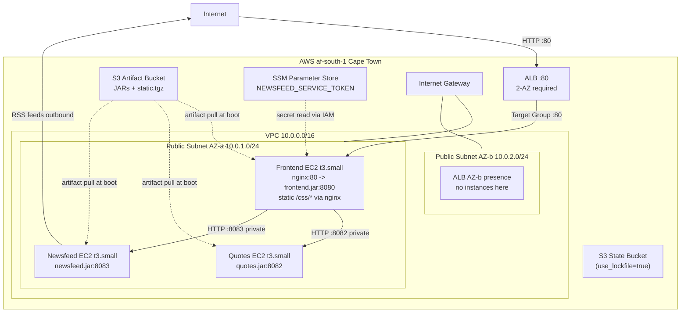

# Melio DevOps Assessment -- Infrastructure as Code Plan

## Architecture Overview



## Story Refinement (Push-Back)

The assessment explicitly asks candidates to push back on underspecified stories. This section demonstrates pragmatic scoping.

> **Original story**: "I need some infrastructure code to provision an environment in the cloud to test features, and deploy the microservices, so that I can verify that the microservices are working"
>
> **Refined scope** (agreed with stakeholders):
> - Single region (af-south-1), single environment (dev), no HA
> - HTTP only (no TLS) -- sufficient for dev/test verification
> - Public subnets only (no NAT gateway) -- acceptable for non-production
> - No CI/CD pipeline -- manual build-and-deploy for now
> - No monitoring/alerting -- basic health checks only via ALB
> - Cleanup/teardown included since this is temporary infrastructure
>
> **Out of scope** (documented in future-work.md):
> - Multi-AZ redundancy, auto-scaling groups
> - Private subnets + NAT gateway for backends
> - TLS termination with ACM certificates
> - CI/CD pipeline (GitHub Actions)
> - Monitoring (CloudWatch, Prometheus)
> - Multi-environment (staging, production)
> - Container migration (ECS/EKS)

## Key Design Decisions and Trade-offs

- **af-south-1 (Cape Town)**: Opt-in region, already enabled on `charteracademy` profile. RSS feeds from US-hosted sites (Reddit, HN) will experience ~250-350ms RTT; the newsfeed service's hardcoded 1s timeout may cause partial results. This is a known limitation to document, not fix.
- **Public subnets for all instances**: Simplicity within the 4-hour time constraint. Security groups enforce strict intra-VPC-only access for backend ports. Private subnets + NAT documented as future work.
- **All 3 instances in same subnet (AZ-a)**: Eliminates cross-AZ latency for frontend-to-backend calls. ALB still spans both subnets (2-AZ requirement). Simplifies debugging during demo.
- **1 instance per service (t3.small)**: Shows microservice deployment patterns. Each service is a single-instance SPOF; ASG (min 2, multi-AZ) is documented as future work. t3.small (2 GiB RAM) provides comfortable headroom for JVM + OS; JVM heap flags still applied for good practice.
- **nginx on frontend EC2**: Production-standard reverse proxy pattern -- serves static CSS at `/css/*` and proxies to `frontend.jar:8080` on port 80. `STATIC_URL=""` so template relative paths resolve through nginx.
- **S3 artifact bucket in bootstrap**: Artifact bucket created during bootstrap (before `terraform apply`) so EC2 user data can pull JARs immediately at boot. Solves the sequencing problem of EC2s booting before artifacts exist.
- **SSM SecureString for token**: `NEWSFEED_SERVICE_TOKEN` stored in SSM Parameter Store, read at boot via IAM policy. Never in version control or tfvars. Note: the token is hardcoded in `newsfeed/core.clj` source -- SSM demonstrates the correct production pattern even though the value is not truly secret here.
- **systemd services**: Each JAR runs as a systemd unit -- auto-restart on failure, proper logging to journald, clean shutdown. JVM launched with `-Xmx512m -XX:+UseSerialGC` to bound memory.
- **Remote state from day 1**: S3 (versioned, encrypted) with native S3 locking (`use_lockfile = true`) in af-south-1. DynamoDB lock table is no longer needed -- Terraform 1.10+ uses S3 conditional writes for atomic locking. Signals state-management hygiene even for a single deployment.
- **Terraform >= 1.9, AWS provider ~> 6.0**: Pinned to current stable versions (Terraform v1.14.8, provider v6.39.0 as of April 2026). Avoids drift from unversioned configs.

## Terraform Module Structure

```
terraform/
  providers.tf              # AWS provider ~> 6.0, profile=charteracademy, region=af-south-1
  backend.tf                # S3 remote state config (af-south-1)
  main.tf                   # Module wiring
  variables.tf              # Root inputs (region, project_name, instance_type, etc.)
  locals.tf                 # Computed values (resource name prefixes, common tags)
  outputs.tf                # ALB DNS, instance IPs, SSH key path
  terraform.tfvars.example  # Template with af-south-1 defaults (gitignored: terraform.tfvars)
  modules/
    networking/             # VPC, 2 public subnets (af-south-1a/b), IGW, route tables
    security/               # SGs (ALB, frontend, backend, SSH), IAM roles/policies
    compute/                # 3 EC2 instances (t3.small), key pair, user data templates
      templates/
        frontend.sh.tpl
        quotes.sh.tpl
        newsfeed.sh.tpl
        nginx.conf.tpl
    alb/                    # ALB, target group, listener, health checks
  bootstrap/                # One-time: S3 state bucket (native locking) + S3 artifact bucket
    main.tf
    variables.tf
    outputs.tf
scripts/
  build-local.sh            # make libs && make clean all (requires Java + Lein)
  build-docker.sh           # Docker-based build (primary, only needs Docker)
  Dockerfile.build          # Clojure/Lein build image (clojure:temurin-17-lein)
  deploy.sh                 # Upload artifacts to S3 artifact bucket
  teardown.sh               # terraform destroy + bootstrap destroy + verify cleanup
```

**Execution flow** (solves artifact sequencing):
1. `bootstrap apply` -- creates S3 state bucket (with native locking support) and S3 artifact bucket
2. `build-docker.sh` -- builds JARs via Docker
3. `deploy.sh` -- uploads JARs + static.tgz to artifact bucket (bucket already exists)
4. `terraform apply` -- creates VPC, EC2s, ALB; EC2 user data pulls JARs from S3 at boot

## Security Group Matrix

| SG | Inbound | Source | Outbound | Notes |
|---|---|---|---|---|
| `alb-sg` | TCP 80 | 0.0.0.0/0 | TCP 80 to `frontend-sg` | Tightened: ALB only needs to reach frontend |
| `frontend-sg` | TCP 80 | `alb-sg` | All 0.0.0.0/0 | Needs to reach backends + any outbound |
| `frontend-sg` | TCP 22 | `var.ssh_cidr` (optional, defaults to none) | -- | Debug-only; prefer SSM Session Manager |
| `backend-sg` | TCP 8082, 8083 | `frontend-sg` | All 0.0.0.0/0 | Newsfeed needs outbound for RSS; quotes does not but uniform rule simplifies |
| `backend-sg` | TCP 22 | `var.ssh_cidr` (optional) | -- | Debug-only |

## Environment Variable Wiring

| Service | Var | Value |
|---|---|---|
| frontend | `APP_PORT` | 8080 |
| frontend | `STATIC_URL` | "" (nginx serves static) |
| frontend | `QUOTE_SERVICE_URL` | `http://<quotes-private-ip>:8082` |
| frontend | `NEWSFEED_SERVICE_URL` | `http://<newsfeed-private-ip>:8083` |
| frontend | `NEWSFEED_SERVICE_TOKEN` | from SSM at boot |
| quotes | `APP_PORT` | 8082 |
| newsfeed | `APP_PORT` | 8083 |

## EC2 User Data Flow (each instance)

All user data scripts begin with `#!/bin/bash` and `set -euxo pipefail` for fail-fast visibility.

1. `dnf install -y java-17-amazon-corretto-headless` (AL2023 uses dnf, not yum)
2. AWS CLI v2 is pre-installed on AL2023 -- no install needed
3. Download `<service>.jar` from S3 artifact bucket **with retry logic**: `for i in 1 2 3; do aws s3 cp ... && break || sleep 10; done`
4. Frontend only: `dnf install -y nginx`, extract `static.tgz` to `/opt/app/static/`, write nginx.conf from template
5. Write systemd unit file for the JAR service with JVM flags: `java -Xmx512m -XX:+UseSerialGC -jar <service>.jar`
6. Read secrets from SSM via `aws ssm get-parameter --with-decryption` (frontend only, for NEWSFEED_SERVICE_TOKEN)
7. Enable and start systemd services (nginx + jar for frontend; jar only for backends)
8. Log completion: `echo "User data complete for <service>" | systemd-cat -t user-data`

---

## Phased Implementation (with git commits)

### Phase 0: Validate Region and Scaffold (~15 min)
- Verify `charteracademy` profile: `aws sts get-caller-identity --profile charteracademy`
- Verify af-south-1 access: `aws ec2 describe-availability-zones --region af-south-1 --profile charteracademy`
- Create `.cursor/rules/terraform.mdc` -- Terraform naming, formatting, module conventions
- Create `.cursor/rules/project.mdc` -- commit message style, PR conventions, no secrets in VCS
- Set up `docs/` folder: `architecture.md` (template), `future-work.md` (template), `trade-offs.md`
- Update [`.gitignore`](.gitignore) -- add `*.tfstate`, `*.tfstate.backup`, `.terraform/`, `terraform.tfvars`, `*.pem`, `build/`
- Create empty `terraform/` directory skeleton (folders + placeholder files)
- **Commit**: `chore: scaffold project structure, cursor rules, and docs templates`

### Phase 1: Bootstrap and Build Artifacts (~30 min)
- `terraform/bootstrap/` in **af-south-1**: S3 state bucket (versioned, encrypted, native S3 locking via `use_lockfile = true`) + **S3 artifact bucket** (versioned, private, encrypted). No DynamoDB needed.
- Apply bootstrap: `cd terraform/bootstrap && terraform init && terraform apply`
- `scripts/Dockerfile.build` -- `FROM clojure:temurin-17-lein` (resolves to Lein 2.12.0, JDK 17), copies repo, runs `make libs && make clean all`
- `scripts/build-docker.sh` -- builds Docker image, extracts `build/*.jar` + `build/static.tgz` to host
- `scripts/build-local.sh` -- fallback: **must** run `make libs && make clean all` (not just `make all` -- Makefile `all` target does NOT invoke `libs`)
- `scripts/deploy.sh` -- `aws s3 cp build/*.jar s3://<artifact-bucket>/` + `aws s3 cp build/static.tgz s3://<artifact-bucket>/`
- Build and upload: `./scripts/build-docker.sh && ./scripts/deploy.sh`
- **Commit**: `feat: add bootstrap, build scripts, Dockerfile, and artifact upload`

### Phase 2: Networking Module (~20 min)
- `terraform/providers.tf` -- AWS provider with `profile = var.aws_profile` (default `"charteracademy"`), `region = var.region` (default `"af-south-1"`), `required_providers { aws = { source = "hashicorp/aws", version = "~> 6.0" } }`, `required_version = ">= 1.9"`
- `terraform/backend.tf` -- S3 backend config pointing to state bucket (same region as bootstrap)
- `terraform/locals.tf` -- computed name prefix `"${var.project_name}-${var.environment}"`, common tags
- `terraform/modules/networking/` -- VPC `10.0.0.0/16`, 2 public subnets in af-south-1a (`10.0.1.0/24`) and af-south-1b (`10.0.2.0/24`), IGW, route tables with `0.0.0.0/0` -> IGW
- Wire networking module in `terraform/main.tf`
- **Commit**: `feat: add networking module with VPC, subnets, and IGW`

### Phase 3: Security Groups and IAM (~20 min)
- `terraform/modules/security/` -- security groups per matrix above (ALB, frontend, backend, optional SSH)
- IAM role `app-instance-role` with policies: SSM `GetParameter` (scoped to `/app/*`), S3 `GetObject` on artifact bucket ARN
- Instance profile attached to all 3 EC2s
- SSM Parameter `/app/newsfeed-service-token` (SecureString) -- created by Terraform, value passed as a sensitive variable (CLI arg or env var, never in tfvars)
- **Commit**: `feat: add security groups, IAM roles, and SSM secret`

### Phase 4: Compute Module -- EC2 Instances (~30 min)
- `terraform/modules/compute/templates/quotes.sh.tpl` -- `set -euxo pipefail`, dnf install Corretto 17, S3 JAR pull with retry, systemd unit with `-Xmx512m -XX:+UseSerialGC`, start
- `terraform/modules/compute/templates/newsfeed.sh.tpl` -- same pattern, port 8083
- `terraform/modules/compute/templates/frontend.sh.tpl` -- same + `dnf install -y nginx`, extract static.tgz, write nginx.conf, start nginx
- `terraform/modules/compute/templates/nginx.conf.tpl` -- `location /css/ { alias /opt/app/static/css/; }` + `location / { proxy_pass http://127.0.0.1:8080; }`
- `terraform/modules/compute/main.tf` -- 3 x `aws_instance` (**t3.small**, AL2023 AMI via `aws_ami` data source with filter `al2023-ami-*-x86_64`, owner `amazon`), **all 3 in subnet-a**
- `aws_key_pair` (TLS-generated for demo; production note to use existing keys or SSM Session Manager)
- Terraform `templatefile()` injects private IPs, S3 artifact bucket name, SSM parameter name, ports into user data
- **Commit**: `feat: add compute module with 3 EC2 instances and user data`

### Phase 5: Application Load Balancer (~15 min)
- `terraform/modules/alb/` -- ALB in both public subnets (af-south-1a + af-south-1b), attached to `alb-sg`
- Target group: port 80, protocol HTTP, health check `GET /ping` on **port 80** (validates full stack: nginx + JVM), interval 30s, healthy threshold 2
- HTTP listener on port 80 forwarding to target group
- Register frontend instance in target group
- Output ALB DNS name as the application URL
- **Commit**: `feat: add ALB with target group, listener, and health checks`

### Phase 6: Documentation and Future Work (~30 min)
- Rewrite `README.md`:
  - **Story Refinement** section (push-back on scope -- see above)
  - Prerequisites: Terraform >= 1.9, AWS CLI v2, Docker Desktop (or Java 17 + Leiningen 2.12), `charteracademy` AWS profile with af-south-1 enabled
  - Quick Start: numbered step-by-step commands:
    1. `cd terraform/bootstrap && terraform init && terraform apply` (state + artifacts bucket)
    2. `./scripts/build-docker.sh` (build JARs)
    3. `./scripts/deploy.sh` (upload to S3)
    4. `cd terraform && terraform init && terraform apply` (infrastructure)
    5. Wait 2-3 min, open ALB DNS URL
  - Variables table (region=af-south-1 default, instance_type=t3.small, project_name, aws_profile, ssh_cidr)
  - Architecture diagram (embed mermaid or link to docs/architecture.md)
  - Secrets handling note
  - Verification commands: `curl http://<ALB-DNS>/ping`, expected browser output
  - Teardown instructions: `./scripts/teardown.sh`
- `docs/architecture.md` -- detailed architecture description with diagram
- `docs/future-work.md`:
  - Multi-AZ with ASG per service (min 2 instances)
  - Private subnets + NAT gateway for backends
  - TLS termination at ALB with ACM certificate
  - CI/CD pipeline (GitHub Actions: build -> test -> deploy)
  - Monitoring: CloudWatch alarms, CloudWatch Logs agent, or Prometheus+Grafana
  - WAF on ALB, GuardDuty, AWS Config compliance rules
  - Multi-environment layout (Terraform workspaces or directory-per-env)
  - Container migration path (ECS Fargate or EKS)
  - SSM Session Manager (replace direct SSH)
  - Cost estimates for each tier
- `docs/trade-offs.md` -- explicit decisions made and why (including af-south-1 RSS latency, public subnets rationale, SSM token pattern)
- **Commit**: `docs: add comprehensive README, architecture, and future work documentation`

### Phase 7: Validation and Teardown (~15 min)
- `terraform plan -out=tfplan` -- review the plan, sanity check resource counts (~15-20 resources)
- `terraform apply tfplan` -- deploy infrastructure deterministically
- Validate: `curl -s http://<ALB-DNS>/ping` (expect HTTP 200)
- Validate: open ALB DNS in browser, verify quotes sidebar + newsfeed list render (newsfeed may be partial due to af-south-1 RSS latency)
- Validate: check cloud-init logs if issues: `aws ssm start-session` or SSH to check `/var/log/cloud-init-output.log`
- `scripts/teardown.sh` -- `cd terraform && terraform destroy -auto-approve && cd bootstrap && terraform destroy -auto-approve`
- Verify no lingering resources in AWS console (filter by `ManagedBy=terraform` tag)
- **Commit**: `chore: add teardown script and validation notes`

---

## Estimated Cost (during demo, af-south-1)

| Resource | af-south-1 Rate | Demo Cost (2-3 hours) |
|---|---|---|
| 3 x t3.small | ~$0.0264/hr each | ~$0.16 |
| ALB | ~$0.027/hr | ~$0.07 |
| S3 (state + artifacts) | negligible | ~$0.00 |
| SSM | free tier | $0.00 |
| **Total** | | **~$0.23** |

## Additional Constraints and Guardrails

1. **Tag everything** -- every Terraform resource gets `Project`, `Environment`, `ManagedBy=terraform` tags via a `default_tags` block in the provider. Makes cleanup easy and shows governance awareness.
2. **`terraform fmt` and `terraform validate`** -- run before every commit. Cursor rule enforces this.
3. **No hardcoded AMIs** -- use `aws_ami` data source with filter `al2023-ami-*-x86_64`, owner `amazon`. Region-agnostic.
4. **Sensitive outputs** -- mark SSH private key and SSM values as `sensitive = true`.
5. **`prevent_destroy` on state bucket** -- lifecycle rule to prevent accidental state loss (remove for final teardown via `teardown.sh`).
6. **`set -euxo pipefail`** in all user data scripts -- fail fast and visibly in cloud-init logs.
7. **S3 artifact download retry** in user data: `for i in 1 2 3; do aws s3 cp ... && break || sleep 10; done`
8. **JVM heap limits** in all systemd units: `-Xmx512m -XX:+UseSerialGC` to bound memory on t3.small (2 GiB).
9. **`terraform plan -out=tfplan` then `terraform apply tfplan`** -- deterministic applies, no drift between plan and apply.
10. **Region variable with validation**: `variable "region" { default = "af-south-1" validation { condition = contains(["af-south-1", "us-east-1"], var.region) } }` -- configurable region, defaults to af-south-1; add additional allowed regions as needed.
11. **Provider version pins**: Terraform `>= 1.9`, AWS provider `~> 6.0`. Avoids surprise breaking changes.

## Risks and Mitigations

| Risk | Impact | Mitigation |
|---|---|---|
| RSS feeds timeout from Cape Town | Degraded newsfeed display (partial/empty) | Document as known limitation; quotes still works. Frontend handles errors gracefully (shows error page, not crash). |
| User data script fails silently | Instance boots but service not running | `set -euxo pipefail`, S3 retry loop, check `/var/log/cloud-init-output.log` |
| Boot timing (frontend before backends) | First page load shows errors | `/ping` is independent of backends; browser refresh after 30-60s resolves. Acceptable for demo. |
| Build fails (lein/Java issues) | No artifacts to deploy | Docker-based build as primary (isolated env); local build as fallback |
| Over time budget (> 4 hours) | Incomplete submission | Time-box each phase; drop ALB if behind (use direct EC2 public IP) |
| Terraform state corruption | Cannot manage infra | S3 versioning + native S3 locking (`use_lockfile = true`) |
| af-south-1 service quirks | Unexpected API errors | Region is configurable via `var.region`; switch to us-east-1 with a single variable change |

## Fallback: Simplified Single-Instance Approach

If behind on time after Phase 2 (networking), fall back to:
- Single t3.small EC2 in af-south-1 with public IP
- All 3 JARs + nginx on one instance (single user data script)
- No ALB (use EC2 public IP directly with security group: HTTP 80 from 0.0.0.0/0)
- Still uses S3 artifact bucket, SSM, systemd -- demonstrates IaC fundamentals
- Can be completed in ~1 hour total from Phase 2

## Potential Issues to Watch For

- **af-south-1 RSS feed latency**: The newsfeed service fetches RSS from US-hosted sites (Reddit, HN, Martin Fowler, ThoughtWorks) with a 1s timeout in `newsfeed/api.clj`. Cape Town to US RTT is ~250-350ms, leaving minimal margin. Expect partial/empty newsfeed results. Document this; quotes page will always work.
- **Boot timing**: Frontend may start before backends are ready. The `/ping` health check passes regardless of backend availability. First page load might show errors -- a browser refresh after 30-60s should resolve. Acceptable for demo scope.
- **AL2023 package availability**: Amazon Corretto 17 via `dnf install -y java-17-amazon-corretto-headless`. Nginx via `dnf install -y nginx`. Both confirmed available in AL2023 default repos.
- **Leiningen/Clojure compatibility**: Project uses Clojure 1.8 (compatible with Java 17). Docker build uses `clojure:temurin-17-lein` (Lein 2.12.0, verified April 2026). Clojure 1.8 runs on JDK 17 without known issues.
- **SSM token is not truly secret**: The token `T1&eWbYXNWG1w1^YGKDPxAWJ@^et^&kX` is hardcoded in `newsfeed/core.clj` source. SSM demonstrates the correct production pattern for secrets management even though this specific value is already in VCS.
- **Makefile `all` does NOT run `libs`**: The `common-utils` library must be installed via `make libs` before `make clean all`. Both build scripts enforce this ordering.

---

## Tools and Research Used

- **Perplexity MCP**: Validated Terraform v1.14.8, AWS provider v6.39.0, af-south-1 opt-in/STS behavior, AL2023 nginx+Corretto availability, Clojure 1.8/Java 17 compatibility, Docker image tags (Lein 2.12.0 confirmed April 2026), t3.small memory, af-south-1 pricing, S3 native state locking (`use_lockfile = true`) -- DynamoDB deprecated
- **Context7 MCP**: Verified AWS provider 6.x S3 resource patterns (`aws_s3_bucket`, `aws_s3_bucket_versioning`, `aws_s3_bucket_server_side_encryption_configuration`, `aws_s3_bucket_public_access_block` remain separate resources)
- **Codebase exploration**: Full source review of all 3 services, Makefile, project.clj files, /ping endpoints, static assets, env var wiring
