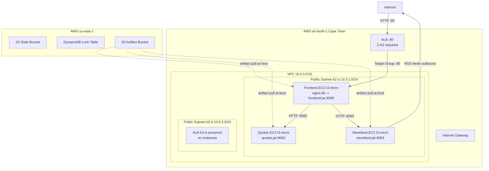

# Melio IaC Assessment -- Revised Plan (af-south-1)

## Critical Findings from Plan Review

### 1. CRITICAL: af-south-1 Is an Opt-In Region

The original plan targets us-east-1. Switching to af-south-1 (Cape Town) has significant implications:

- **Must be enabled at account level first** via AWS Console (Account Settings > Regions) or CLI: `aws account enable-region --region-name af-south-1`. This can take minutes to hours.
- **STS regional endpoint is NOT active by default** -- IAM/STS calls may fail unless the regional STS endpoint is explicitly activated in IAM settings, or code uses the global endpoint.
- **Pricing is ~27% higher** for EC2 t3.micro ($0.0132/hr vs $0.0104/hr in us-east-1).
- **RSS feed latency**: The newsfeed service fetches RSS from US-hosted sites (Reddit, HN, Martin Fowler, ThoughtWorks). Round-trip from Cape Town to US is ~250-350ms. With the hardcoded 1-second timeout in `newsfeed/api.clj`, feeds will frequently timeout or return partial results. **This is a known limitation to document, not fix.**
- **Prerequisite**: Verify `charteracademy` profile has af-south-1 enabled before any Terraform work.

**Action**: Add a "Phase 0.5" step to validate region access. Add a guard in Terraform (or a pre-flight script) that checks region availability.

### 2. CRITICAL: Makefile `libs` Dependency Not in `all` Target

The Makefile's `all` target builds uberjars but does NOT invoke `make libs`. The `common-utils` library must be installed to `~/.m2` before any service can build. Both `build-docker.sh` and `build-local.sh` **must** run `make libs && make clean all`, not just `make clean all`.

The existing plan's Phase 3 `Dockerfile.build` description says "runs `make libs && make clean all`" -- this is correct in the description but must be verified in implementation. The `build-local.sh` script description only says "make libs && make clean all" -- **both scripts must enforce this ordering**.

### 3. CRITICAL: ALB Health Check Port Mismatch

The plan states: *"health check `GET /ping` on port 8080 (container port)"*. This is wrong.

The ALB target group routes to port 80 (nginx on frontend EC2). The health check should be on **port 80**, and nginx will proxy `/ping` to `localhost:8080` which returns 200. If you set the health check port to 8080, it bypasses nginx and checks the JVM directly, which might be acceptable but is inconsistent with the target group configuration.

**Recommendation**: Health check on port 80 (matching target group port). This validates the full stack: nginx + JVM.

### 4. HIGH: t3.micro Memory Pressure

Each service runs a JVM (Clojure 1.8 uberjar on Corretto 17). JVM base overhead is 200-400MB idle. t3.micro has 1 GiB total.

- **Backend services (quotes, newsfeed)**: Minimal JVM apps, can likely fit with `-Xmx256m -XX:+UseSerialGC`.
- **Frontend**: Runs nginx + JVM. Nginx adds ~10-30MB, but the combined footprint may push against limits.

**Recommendation**: Add JVM heap flags in systemd unit files: `-Xmx384m -XX:+UseSerialGC` for backends, `-Xmx256m` for frontend (leaving room for nginx). If OOM issues occur, upgrade frontend to t3.small ($0.0264/hr in af-south-1). Document this as a known constraint.

### 5. HIGH: Terraform and Provider Version Pinning

| Component | Plan Says | Current (April 2026) | Recommendation |
|---|---|---|---|
| Terraform | >= 1.5 | v1.14.8 | `required_version = ">= 1.9"` |
| AWS Provider | not specified | v6.39.0 | `version = "~> 6.0"` |
| Docker build image | `clojure:temurin-17-lein-2.11.2` | lein 2.12.0 available | `clojure:temurin-17-lein-2.12.0` |

Pin the AWS provider to `~> 6.0` in `providers.tf`. Using `>= 1.9` for Terraform gives access to modern features without being too aggressive.

### 6. HIGH: S3 Remote State Bucket Placement

For an opt-in region, the S3 backend bucket for Terraform state should be in **us-east-1** (global, always-on region) rather than af-south-1. This:
- Avoids the chicken-and-egg problem of needing the opt-in region enabled before bootstrap
- Ensures state is always accessible regardless of regional issues
- DynamoDB lock table should also be in us-east-1

The infrastructure itself deploys to af-south-1, but state management lives in us-east-1.

### 7. MODERATE: Instance Placement -- All Same Subnet

The original plan splits instances across 2 AZs (quotes in AZ-a, newsfeed in AZ-b). For a demo:
- Frontend-to-backend calls cross AZ boundaries (adds ~1-2ms latency, minor cost)
- ALB requires 2 AZs minimum, so we still need 2 subnets
- But all 3 EC2 instances should go in **the same subnet** (single AZ) for simplicity
- **ALB spans both subnets** (required), frontend EC2 + backends in one subnet

This simplifies the security group wiring and reduces variables during debugging.

### 8. MODERATE: Security Group Matrix Corrections

| Issue | Current Plan | Correction |
|---|---|---|
| ALB outbound | "All to VPC" | Should be "TCP 80 to frontend-sg only" |
| Backend outbound | "All (newsfeed needs outbound for RSS)" | Correct, but should note **only newsfeed** needs internet outbound; quotes does not |
| SSH source | `var.ssh_cidr` defaults to none | Good, but consider SSM Session Manager as default access method (no SSH SG needed) |

### 9. MODERATE: Cost Table Needs af-south-1 Rates

| Resource | af-south-1 Rate | Demo Cost (2-3 hours) |
|---|---|---|
| 3x t3.micro | $0.0132/hr each | ~$0.08 |
| ALB | ~$0.027/hr (estimated) | ~$0.07 |
| S3 (us-east-1 state) | negligible | ~$0.00 |
| SSM | free tier | $0.00 |
| DynamoDB (us-east-1) | on-demand | ~$0.00 |
| **Total** | | **~$0.15** |

---

## Assessment Scoring: What The Plan Must Demonstrate

### A. Story Refinement ("Push Back")

The assessment **explicitly** says to push back on the user story. The plan should include a "Story Refinement" section in the README/docs that states:

> **Original story**: "I need some infrastructure code to provision an environment in the cloud to test features, and deploy the microservices, so that I can verify that the microservices are working"
>
> **Refined scope** (agreed with stakeholders):
> - Single region (af-south-1), single environment (dev), no HA
> - HTTP only (no TLS) -- sufficient for dev/test verification
> - Public subnets only (no NAT gateway) -- acceptable for non-production
> - No CI/CD pipeline -- manual build-and-deploy for now
> - No monitoring/alerting -- basic health checks only
> - Cleanup/teardown included since this is temporary infrastructure
>
> **Out of scope** (documented as future work):
> - Multi-AZ redundancy, auto-scaling groups
> - Private subnets + NAT gateway
> - TLS termination with ACM certificates
> - CI/CD pipeline (GitHub Actions)
> - Monitoring (CloudWatch, Prometheus)
> - Multi-environment (staging, production)
> - Container migration (ECS/EKS)

This explicitly demonstrates pragmatic scoping and stakeholder communication.

### B. IaC Fluency Checklist

The plan correctly addresses:
- [x] Modular structure (`modules/networking`, `modules/security`, `modules/compute`, `modules/alb`)
- [x] Variables, outputs, environment-level parameters
- [x] Separate concerns by module
- [x] Remote state (S3 + DynamoDB)
- [x] `default_tags` for governance
- [x] Data sources for AMI (not hardcoded)
- [x] Sensitive values handling (SSM, sensitive outputs)

**Missing**:
- [ ] `terraform.tfvars.example` should include af-south-1 defaults
- [ ] Provider version constraint in `providers.tf`
- [ ] `terraform fmt` / `terraform validate` as a pre-commit or documented step
- [ ] A `locals.tf` for computed values (e.g., resource name prefixes)

### C. Clean Separation of Concerns

The README flow should be:

```
1. Enable af-south-1 region (one-time AWS Console action)
2. ./scripts/build-docker.sh          # Build JARs (requires Docker only)
3. cd terraform/bootstrap && terraform init && terraform apply   # State infra in us-east-1
4. cd terraform && terraform init && terraform apply             # App infra in af-south-1
5. ./scripts/deploy.sh                # Upload JARs to S3
6. Wait 2-3 minutes for EC2 boot
7. Open ALB DNS URL in browser
8. ./scripts/teardown.sh              # Destroy everything
```

**Issue with current flow**: The plan has deploy.sh uploading to S3 *before* `terraform apply`, but the S3 artifact bucket is created by Terraform. The correct order is: bootstrap -> terraform apply (creates S3 bucket + EC2s) -> deploy.sh (uploads JARs) -> EC2s pull JARs at boot.

Actually, re-reading the plan: the S3 bucket is a Terraform resource and EC2 user data pulls from S3 at boot time. So the flow should be:
1. Build JARs
2. Bootstrap state backend
3. `terraform apply` (creates S3 bucket + EC2s; EC2 user data tries to pull JARs at boot)
4. Upload JARs to S3 (after bucket exists)
5. Reboot/recreate EC2s or trigger re-pull

**This is a sequencing problem**: EC2s boot and try to pull JARs that aren't uploaded yet. Options:
- **Option A**: S3 bucket in bootstrap (created first), then deploy JARs, then `terraform apply` (EC2s boot and find JARs)
- **Option B**: Two-stage apply: first apply creates bucket, deploy script uploads, second apply or EC2 reboot pulls JARs
- **Option C**: Embed JARs in user data (base64 encoded -- too large)
- **Option D**: User data script retries S3 download with backoff

**Recommendation**: Option A -- move S3 artifact bucket to the bootstrap module. This cleanly separates the flow: bootstrap (state + artifact bucket) -> build -> deploy -> terraform apply (infrastructure + EC2s that find JARs already in S3).

---

## Revised Architecture (af-south-1)



**Change from original**: All 3 instances in the same subnet (AZ-a). ALB spans both subnets as required. State + artifact buckets in us-east-1.

---

## Revised Phased Implementation

### Phase 0: Validation and Scaffolding (~15 min)
- Verify `charteracademy` profile works: `aws sts get-caller-identity --profile charteracademy`
- Verify af-south-1 is enabled: `aws ec2 describe-regions --region-names af-south-1 --profile charteracademy`
- If not enabled, enable via console/CLI and wait
- Create project scaffolding (`.gitignore`, `terraform/` skeleton, `scripts/`, `docs/`)
- Create `.cursor/rules/terraform.mdc` for conventions

### Phase 1: Bootstrap (us-east-1) (~15 min)
- `terraform/bootstrap/` in **us-east-1**: S3 state bucket (versioned, encrypted) + DynamoDB lock table + S3 artifact bucket
- Apply bootstrap
- Verify buckets exist

### Phase 2: Build and Upload Artifacts (~20 min)
- `scripts/Dockerfile.build` using `clojure:temurin-17-lein-2.12.0`
- `scripts/build-docker.sh`: `make libs && make clean all` inside container, extract to `build/`
- `scripts/deploy.sh`: upload `build/*.jar` and `build/static.tgz` to S3 artifact bucket
- Build and deploy artifacts

### Phase 3: Networking Module (~20 min)
- `terraform/modules/networking/`: VPC 10.0.0.0/16, 2 public subnets in af-south-1a and af-south-1b, IGW, route tables
- `terraform/providers.tf`: AWS provider with `profile = "charteracademy"`, `region = var.region` (default af-south-1), version `~> 6.0`
- `terraform/backend.tf`: S3 backend in **us-east-1**
- Wire networking module in `terraform/main.tf`

### Phase 4: Security + IAM (~20 min)
- `terraform/modules/security/`: SGs (ALB, frontend, backend, optional SSH)
- IAM role with S3 GetObject on artifact bucket + SSM read
- Instance profile
- SSM parameter for NEWSFEED_SERVICE_TOKEN

### Phase 5: Compute Module (~30 min)
- `terraform/modules/compute/`: 3 x `aws_instance` (t3.micro, AL2023, all in subnet-a)
- User data templates with:
  - `dnf install -y java-17-amazon-corretto-headless nginx`
  - JVM heap flags: `-Xmx384m -XX:+UseSerialGC`
  - systemd units with auto-restart
  - S3 artifact download with retry logic
  - nginx config for frontend only
- `aws_key_pair` (optional, for debugging)

### Phase 6: ALB Module (~15 min)
- `terraform/modules/alb/`: ALB in both subnets, `alb-sg`
- Target group on port 80, health check `GET /ping` on **port 80**
- HTTP listener forwarding to target group
- Register frontend instance
- Output ALB DNS

### Phase 7: Apply, Validate, Document (~30-45 min)
- `terraform plan` -> review -> `terraform apply`
- Wait 2-3 minutes for boot
- Validate: `curl http://<ALB-DNS>/ping`, open in browser
- Write comprehensive README with step-by-step commands
- Write `docs/future-work.md` and `docs/trade-offs.md`
- Write `scripts/teardown.sh`
- Commit and push

---

## Risks and Mitigations

| Risk | Impact | Mitigation |
|---|---|---|
| af-south-1 not enabled on account | Blocker | Check first, have us-east-1 as fallback in variables |
| RSS feeds timeout from Cape Town | Degraded newsfeed display | Document as known limitation; quotes still works |
| t3.micro OOM | Service crashes | JVM heap flags; fallback to t3.small variable |
| Build fails (lein/Java issues) | No artifacts | Docker-based build as primary; local as fallback |
| User data script fails silently | Instance boots but service not running | Add `set -euxo pipefail` in scripts; check cloud-init logs |
| Over time budget (> 4 hours) | Incomplete submission | Time-box each phase; drop ALB if behind (use direct EC2 IP) |
| Terraform state corruption | Cannot manage infra | S3 versioning + DynamoDB locking |

## Fallback: Simplified Single-Instance Approach

If behind on time after Phase 3, fall back to:
- Single t3.small EC2 in af-south-1
- All 3 JARs + nginx on one instance
- No ALB (use EC2 public IP directly)
- Security group: HTTP 80 from 0.0.0.0/0, SSH from your IP
- This can be done in ~1 hour total and still demonstrates IaC fundamentals

---

## Identified Trade-Off Corrections

1. **Public subnets rationale**: Change from "avoid $32/month NAT Gateway cost" to "simplicity within 4-hour time constraint; private subnets + NAT documented as future work"
2. **1 instance per service**: This is correct but note the tradeoff: 3 instances = 3x the failure surface for user data scripts. For a demo, it shows microservice deployment patterns but adds deployment complexity.
3. **SSM for token**: The token `T1&eWbYXNWG1w1^YGKDPxAWJ@^et^&kX` is hardcoded in `newsfeed/core.clj` source. SSM is security theater here but demonstrates the correct pattern for real secrets. Document this distinction.
4. **Remote state**: Valuable signal but adds a bootstrap step. Worth it for the assessment.
5. **ALB vs direct access**: ALB adds infrastructure and a module. Worth it for the assessment to demonstrate load balancer IaC, but have the fallback of direct EC2 access if time-constrained.

## Additional Guardrails Missing from Original Plan

1. **`set -euxo pipefail`** in all user data scripts -- fail fast and visibly
2. **`cloud-init` status check** in validation phase: `aws ssm send-command` or SSH to check `/var/log/cloud-init-output.log`
3. **S3 artifact download retry** in user data: `for i in 1 2 3; do aws s3 cp ... && break || sleep 10; done`
4. **JVM heap limits** in systemd unit environment
5. **nginx `proxy_connect_timeout`** and `proxy_read_timeout` tuned (default 60s is fine, but worth noting)
6. **`terraform plan -out=tfplan` then `terraform apply tfplan`** pattern for deterministic applies
7. **Region variable with validation**: `variable "region" { validation { condition = contains(["af-south-1"], var.region) } }`

---

## Tools and MCPs Used in This Analysis

- **Perplexity MCP** (`perplexity_ask`): Validated Terraform v1.14.8, AWS provider v6.39.0, af-south-1 opt-in status, STS endpoint behavior, AL2023 nginx availability, Clojure/Java 17 compatibility, Docker image tags, t3.micro memory considerations
- **Codebase exploration subagent**: Full directory structure, all source files, Makefile targets, project.clj dependencies, /ping endpoints, static assets
- **Direct file reads**: All service source code (core.clj, data.clj, views.clj, utils.clj, api.clj, routes.clj), common-utils, Makefile, README.md, problem statement PDF
