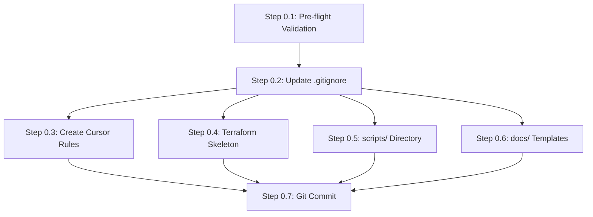

# Phase 0: Validate Region and Scaffold -- Execution Plan

## Gaps and Flaws Identified in Original Phase 0 Specification

Before diving into execution, these issues were found in the original Phase 0 description and are resolved in this execution plan:

### Gaps (missing from original)
- **No prerequisite tooling check**: Original only validates AWS profile/region but not `terraform`, `docker`, or `aws` CLI versions -- all required by Phase 1+
- **No `.terraform.lock.hcl` handling**: HashiCorp best practice (confirmed via Perplexity, 2026 sources) is to COMMIT this file. Original `.gitignore` additions list didn't mention it, risking accidental exclusion
- **`.cursor/plans/` not gitignored**: Plans are local dev artifacts and should not be committed, but `.cursor/rules/` SHOULD be committed (shared conventions)
- **`scripts/` directory not in Phase 0**: Part of the overall project structure (Phase 1 depends on it) but not mentioned in Phase 0 scaffolding -- include as empty scaffold for structural completeness
- **`terraform.tfvars.example`**: Listed in the module structure diagram but not explicitly called out in Phase 0 tasks
- **Empty directory tracking**: Git does not track empty directories. `terraform/modules/compute/templates/` and `scripts/` need `.gitkeep` sentinel files
- **Cursor rules content unspecified**: The original plan says "create rules" but doesn't detail what they should contain -- these are the most important scaffolding artifacts since they guide all subsequent AI-assisted work
- **Branch strategy**: Original plan doesn't specify -- currently on `develop`

### Design Considerations (not flaws, but trade-offs to document)
- **State bucket in af-south-1**: Accepted trade-off -- simpler (everything one region), but if af-south-1 has issues, state is inaccessible. Documented in cursor rules + trade-offs.md template
- **No `.editorconfig`**: `terraform fmt` is enforced by convention (cursor rule) not tooling. Acceptable for a time-boxed assessment

---

## Execution Order

The steps below are ordered for dependency correctness: validate environment first, then configure rules that guide AI, then scaffold structure.

---

## Step 0.1: Pre-flight Validation (~2 min)

**Purpose**: Confirm all prerequisites before creating any files.

### AWS Validation
- `aws sts get-caller-identity --profile charteracademy` -- confirm identity
- `aws ec2 describe-availability-zones --region af-south-1 --profile charteracademy` -- confirm region access and enumerate AZs (need af-south-1a, af-south-1b)

### Local Tooling Checks
- `terraform version` -- confirm >= 1.9 (expect v1.14.x)
- `aws --version` -- confirm AWS CLI v2
- `docker --version` -- confirm Docker available (needed for Phase 1 build)

### Decision Gate
- If any check fails, STOP and resolve before proceeding
- If af-south-1 AZs don't include both `af-south-1a` and `af-south-1b`, the networking module design needs revision (unlikely but worth confirming)

---

## Step 0.2: Update [`.gitignore`](.gitignore) (~2 min)

**Purpose**: Ensure Terraform, secrets, and IDE artifacts are excluded before any new files are created.

### Current state
The existing `.gitignore` already covers: `/build/`, `target`, `*.jar`, `*.class`, `.lein-*`, `.idea/`, etc.

### Additions needed (append to existing file, do not duplicate)

**Terraform section:**
- `*.tfstate`
- `*.tfstate.backup`
- `.terraform/`
- `terraform.tfvars` (sensitive -- template is `terraform.tfvars.example`)
- `crash.log`
- `override.tf` / `override.tf.json` / `*_override.tf` / `*_override.tf.json`

**Important: Do NOT add `.terraform.lock.hcl`** -- this file MUST be committed per HashiCorp best practice for reproducible provider installations.

**SSH keys:**
- `*.pem`

**Cursor IDE (plans are local, rules are shared):**
- `.cursor/plans/`

**Note**: Do NOT add `.cursor/rules/` -- these are project conventions that should be version-controlled.

---

## Step 0.3: Create Cursor Rules (~5 min)

**Purpose**: Establish AI guidance that shapes all subsequent phases. These are the most impactful Phase 0 artifacts.

### Rule 1: `.cursor/rules/terraform.mdc`

**Frontmatter:**
- `description`: "Terraform conventions for AWS infrastructure -- provider ~> 6.0, module patterns, naming, tagging"
- `globs`: `terraform/**/*.tf`
- `alwaysApply`: false

**Content guidance** (under 50 lines per best practice):
- Terraform version constraint: `>= 1.9`; AWS provider: `~> 6.0`
- Provider config: `profile = var.aws_profile`, `region = var.region`, `default_tags` block with Project, Environment, ManagedBy tags
- Module structure: each module directory has `main.tf`, `variables.tf`, `outputs.tf`
- Naming: snake_case, resources prefixed with `local.name_prefix` (e.g., `"${var.project_name}-${var.environment}"`)
- No hardcoded AMIs -- always use `aws_ami` data source with owner filter
- Sensitive outputs: mark with `sensitive = true`
- Variables: include `description`, `type`, and `validation` blocks where appropriate
- Run `terraform fmt` and `terraform validate` before every commit
- Remote state: S3 backend (versioned, encrypted) + DynamoDB lock in af-south-1
- The `.terraform.lock.hcl` file must always be committed

### Rule 2: `.cursor/rules/project.mdc`

**Frontmatter:**
- `description`: "Melio DevOps assessment project conventions -- commits, secrets, scripts, architecture decisions"
- `alwaysApply`: true

**Content guidance** (under 50 lines):
- Commit messages: conventional commits format (`feat:`, `fix:`, `chore:`, `docs:`)
- No secrets in VCS: token stored in SSM, `.tfvars` is gitignored, use `terraform.tfvars.example` as template
- Shell scripts: always start with `#!/bin/bash` and `set -euxo pipefail`
- Architecture scope: af-south-1, single environment (dev), public subnets, no HA -- this is a time-boxed demo
- When in doubt, choose simplicity over perfection; document trade-offs in `docs/trade-offs.md`
- Always tag resources via provider `default_tags`
- Reference the full architecture plan at [`.cursor/plans/melio_iac_assessment_plan_349f73ef.plan.md`](.cursor/plans/melio_iac_assessment_plan_349f73ef.plan.md)

### Rule 3: `.cursor/rules/user-data.mdc` (additional rule -- not in original plan)

**Rationale**: User data templates (`.tpl` files) are a critical and error-prone part of this project. A dedicated rule prevents common mistakes.

**Frontmatter:**
- `description`: "EC2 user data template conventions -- fail-fast, JVM flags, S3 retry, systemd"
- `globs`: `terraform/**/templates/*.tpl`
- `alwaysApply`: false

**Content guidance** (under 30 lines):
- Always start with `#!/bin/bash` and `set -euxo pipefail`
- AL2023 uses `dnf`, not `yum`
- JVM flags: `-Xmx512m -XX:+UseSerialGC` on t3.small (2 GiB RAM)
- S3 artifact download: retry loop (`for i in 1 2 3; do ... && break || sleep 10; done`)
- Services run as systemd units with `Restart=on-failure`
- Log completion: `echo "User data complete for <service>" | systemd-cat -t user-data`

---

## Step 0.4: Create Terraform Directory Skeleton (~3 min)

**Purpose**: Establish the module structure from the plan so all subsequent phases just fill in content.

### Directory structure to create

```
terraform/
  providers.tf
  backend.tf
  main.tf
  variables.tf
  locals.tf
  outputs.tf
  terraform.tfvars.example
  modules/
    networking/
      main.tf
      variables.tf
      outputs.tf
    security/
      main.tf
      variables.tf
      outputs.tf
    compute/
      main.tf
      variables.tf
      outputs.tf
      templates/
        .gitkeep
    alb/
      main.tf
      variables.tf
      outputs.tf
  bootstrap/
    main.tf
    variables.tf
    outputs.tf
```

### File content decisions
- **All `.tf` files**: Empty files (valid HCL; `terraform validate` passes on empty files)
- **`terraform.tfvars.example`**: Populated with variable names and af-south-1 defaults as comments -- this is the one non-empty scaffold file since it serves as documentation for users
- **`terraform/modules/compute/templates/.gitkeep`**: Empty sentinel to track the directory

### `terraform.tfvars.example` content guidance
- `region` = "af-south-1"
- `project_name` = "melio-devops"
- `environment` = "dev"
- `instance_type` = "t3.small"
- `aws_profile` = "charteracademy"
- `ssh_cidr` commented out with note: "# Uncomment and set to YOUR_IP/32 for SSH access"

---

## Step 0.5: Create `scripts/` Directory Skeleton (~1 min)

**Purpose**: Pre-create the scripts directory that Phase 1 will populate. Avoids the Phase 1 commit mixing structural creation with actual script content.

### Create
- `scripts/.gitkeep` -- empty sentinel

**Note**: The actual scripts (`build-docker.sh`, `build-local.sh`, `deploy.sh`, `teardown.sh`, `Dockerfile.build`) are Phase 1 deliverables.

---

## Step 0.6: Create `docs/` Templates (~3 min)

**Purpose**: Scaffold documentation files with section headers that guide Phase 6 writing.

### `docs/architecture.md`
Template sections:
- Title and overview placeholder
- Architecture diagram placeholder (reference the mermaid diagram from the plan)
- Service descriptions (frontend, quotes, newsfeed)
- Networking layout
- Security model
- Data flow

### `docs/future-work.md`
Template sections (categories from the plan):
- Multi-AZ with ASG
- Private subnets + NAT gateway
- TLS termination (ACM)
- CI/CD pipeline
- Monitoring and alerting
- WAF / GuardDuty / Config
- Multi-environment layout
- Container migration (ECS/EKS)
- SSM Session Manager

### `docs/trade-offs.md`
Template sections:
- Decision log format: Decision / Options Considered / Chosen / Rationale
- Pre-populated decision headings from the plan:
  - af-south-1 region selection
  - Public subnets for all instances
  - All instances in same AZ
  - SSM for token (security pattern vs actual secret)
  - Remote state in af-south-1 (vs us-east-1 alternative)
  - t3.small instance type
  - HTTP only (no TLS)

---

## Step 0.7: Commit (~1 min)

**Message**: `chore: scaffold project structure, cursor rules, and docs templates`

### Files in commit
- `.gitignore` (modified)
- `.cursor/rules/terraform.mdc` (new)
- `.cursor/rules/project.mdc` (new)
- `.cursor/rules/user-data.mdc` (new)
- `terraform/**` (new skeleton)
- `scripts/.gitkeep` (new)
- `docs/architecture.md` (new template)
- `docs/future-work.md` (new template)
- `docs/trade-offs.md` (new template)

### Pre-commit checks
- Verify `.cursor/plans/` is NOT staged (should be gitignored)
- Verify `terraform.tfvars` is NOT staged (only `terraform.tfvars.example` should be)
- Verify no secrets or credentials in any staged file

---

## Dependency Graph



Steps 0.3 through 0.6 are parallelizable after .gitignore is updated. In practice with Cursor, we execute them sequentially for clean diffs.

---

## Flags for Subsequent Phases

Phase 0 establishes conventions that constrain later phases. Key encoding decisions:

- **Cursor rules encode af-south-1 as the target region** -- if region changes, update `terraform.mdc` and `terraform.tfvars.example`
- **`user-data.mdc` rule is an addition** not in the original plan -- it covers a high-risk area (user data scripts are the #1 source of deployment failures)
- **`scripts/` directory is pre-created** -- Phase 1 can immediately add script files without structural commits
- **`.terraform.lock.hcl` will be committed** -- Phase 2 (first `terraform init`) will generate this file; it goes into that phase's commit

---

## Tools and MCPs Used

- **Perplexity MCP** (`perplexity_ask`): Validated `.terraform.lock.hcl` commit best practice (2026 sources), confirmed `default_tags` syntax for AWS provider ~> 6.0
- **Context7 MCP** (`resolve-library-id`, `query-docs`): Retrieved AWS provider 6.15.0 documentation for `default_tags` block configuration and provider arguments
- **Perplexity MCP** (`perplexity_search`): Researched Cursor IDE `.mdc` rule file format and conventions for 2026
- **Codebase exploration subagent**: Full directory tree, all source files, Makefile, `.gitignore`, existing plans
- **Create Rule skill**: Read for `.mdc` file format specification (YAML frontmatter: description, globs, alwaysApply)
