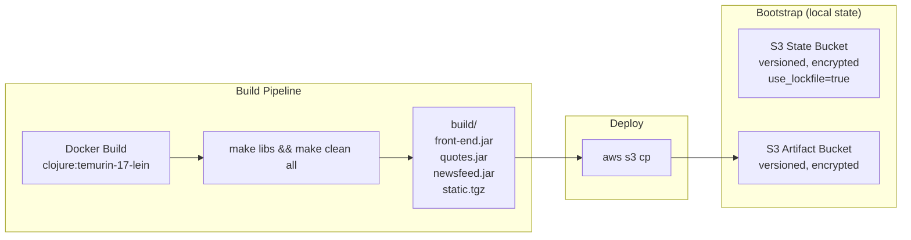

# Phase 1: Bootstrap and Build Artifacts -- Execution Plan

## Research Findings That Change the Master Plan

Three corrections from live research (Perplexity MCP + Context7 MCP, April 2026):

1. **No DynamoDB needed**: Terraform 1.9+ (installed: v1.14.8) supports `use_lockfile = true` for native S3 state locking. DynamoDB table is dropped from bootstrap. Documented as a pre-1.9 alternative in `docs/trade-offs.md`.
2. **Docker image tag correction**: `clojure:temurin-17-lein-2.12.0` is NOT a valid Docker Hub tag. Correct tag: `clojure:temurin-17-lein` (ships latest Leiningen + Temurin JDK 17).
3. **S3 bucket resources**: AWS provider 6.x still uses separate resources for versioning (`aws_s3_bucket_versioning`), encryption (`aws_s3_bucket_server_side_encryption_configuration`), and public access (`aws_s3_bucket_public_access_block`). No consolidation from 5.x.

## Gaps and Flaws Identified in Master Plan Phase 1

- **Missing `providers.tf` in bootstrap/**: Bootstrap is a standalone root module; it needs its own `terraform {}` block with `required_providers` and provider config. Phase 0 validation (Observation D) flagged this.
- **Bootstrap state is LOCAL**: The state bucket doesn't exist yet when bootstrap runs. Bootstrap's own state lives in `terraform/bootstrap/terraform.tfstate` (gitignored). This must be documented -- losing this file before teardown means manual cleanup.
- **S3 bucket naming uniqueness**: S3 names are globally unique. Plan uses `${var.project_name}-${var.environment}-*` but should incorporate AWS account ID via `data.aws_caller_identity.current.account_id` for safety.
- **`scripts/.gitkeep` missing**: Phase 0 exploration shows `scripts/` directory exists but has no files. Git won't track it on clone without a sentinel. Needs `.gitkeep` or we delete it and let Phase 1 scripts create the directory implicitly.
- **Artifact bucket access policy**: The master plan's IAM policy (Phase 3) grants `s3:GetObject` on the artifact bucket. But `deploy.sh` needs `s3:PutObject`. The deploying user (charteracademy profile) likely has broad S3 access, but we should document this assumption.
- **Windows compatibility**: User is on Windows 10. Bash scripts run via Git Bash or WSL. Docker Desktop handles Linux containers. The `build-docker.sh` script must use portable paths (no hardcoded `/` vs `\`).
- **Makefile artifact names**: The Makefile produces `build/front-end.jar`, `build/quotes.jar`, `build/newsfeed.jar`, `build/static.tgz`. Deploy script must match these exact names.

## Architecture (Phase 1 Scope Only)



## Branch Strategy

- Create branch `feature/phase-1-bootstrap-build` from current `Feature/Iac-implementation`
- Single commit at completion: `feat: add bootstrap, build scripts, Dockerfile, and artifact upload`
- Merge back to `Feature/Iac-implementation` after validation

---

## Step 1.1: Create Feature Branch (~1 min)

```bash
git checkout -b feature/phase-1-bootstrap-build
```

---

## Step 1.2: Bootstrap Provider Configuration (~3 min)

**New file**: [`terraform/bootstrap/providers.tf`](terraform/bootstrap/providers.tf)

This file is required because bootstrap is a separate Terraform root module. It needs:

- `terraform` block with `required_version = ">= 1.9"` and `required_providers { aws ~> 6.0 }`
- No `backend` block (bootstrap uses LOCAL state intentionally)
- `provider "aws"` with `profile = var.aws_profile`, `region = var.region`, `default_tags` block matching the convention in `terraform.mdc`

---

## Step 1.3: Bootstrap Main Configuration (~10 min)

**File**: [`terraform/bootstrap/main.tf`](terraform/bootstrap/main.tf)

### Data source
- `data "aws_caller_identity" "current" {}` -- for account ID in bucket names

### Resource: S3 State Bucket
- `aws_s3_bucket.terraform_state` -- bucket name: `"${var.project_name}-${var.environment}-tfstate-${data.aws_caller_identity.current.account_id}"`
- `lifecycle { prevent_destroy = true }` -- protect against accidental deletion (teardown.sh will handle removal)
- `aws_s3_bucket_versioning.terraform_state` -- `status = "Enabled"`
- `aws_s3_bucket_server_side_encryption_configuration.terraform_state` -- `sse_algorithm = "AES256"` (SSE-S3)
- `aws_s3_bucket_public_access_block.terraform_state` -- all four flags `true`

### Resource: S3 Artifact Bucket
- `aws_s3_bucket.artifacts` -- bucket name: `"${var.project_name}-${var.environment}-artifacts-${data.aws_caller_identity.current.account_id}"`
- `aws_s3_bucket_versioning.artifacts` -- `status = "Enabled"` (rollback capability)
- `aws_s3_bucket_server_side_encryption_configuration.artifacts` -- `sse_algorithm = "AES256"`
- `aws_s3_bucket_public_access_block.artifacts` -- all four flags `true`

Total resources: **9** (2 buckets + 2 versioning + 2 encryption + 2 public access block + 1 data source)

---

## Step 1.4: Bootstrap Variables (~3 min)

**File**: [`terraform/bootstrap/variables.tf`](terraform/bootstrap/variables.tf)

- `variable "region"` -- default `"af-south-1"`, validation for allowed regions
- `variable "project_name"` -- default `"melio-devops"`
- `variable "environment"` -- default `"dev"`
- `variable "aws_profile"` -- default `"charteracademy"`

---

## Step 1.5: Bootstrap Outputs (~3 min)

**File**: [`terraform/bootstrap/outputs.tf`](terraform/bootstrap/outputs.tf)

- `output "state_bucket_name"` -- the state bucket name (used by `terraform/backend.tf` in Phase 2)
- `output "state_bucket_arn"` -- for IAM policies
- `output "artifact_bucket_name"` -- used by `deploy.sh` and EC2 user data
- `output "artifact_bucket_arn"` -- for IAM policies in Phase 3
- `output "region"` -- echo back for verification

---

## Step 1.6: Dockerfile.build (~5 min)

**New file**: [`scripts/Dockerfile.build`](scripts/Dockerfile.build)

```
FROM clojure:temurin-17-lein
WORKDIR /app
COPY . .
RUN make libs && make clean all
```

Key design decisions:
- Tag `clojure:temurin-17-lein` (NOT `clojure:temurin-17-lein-2.12.0` -- invalid tag per Docker Hub research)
- `COPY . .` copies entire monorepo (common-utils, front-end, quotes, newsfeed, Makefile)
- `make libs` first installs `common-utils` to Maven local repo (`~/.m2`) inside the container
- `make clean all` builds all 3 uberjars + `static.tgz`
- No `CMD` -- this is a build-only image, artifacts extracted via `docker cp`
- Add `.dockerignore` to exclude `.git/`, `.terraform/`, `build/`, `docs/`, `.cursor/` from the build context

---

## Step 1.7: build-docker.sh (~5 min)

**New file**: [`scripts/build-docker.sh`](scripts/build-docker.sh)

Script flow:
1. `#!/bin/bash` + `set -euxo pipefail`
2. `SCRIPT_DIR="$(cd "$(dirname "${BASH_SOURCE[0]}")" && pwd)"` -- resolve script location
3. `PROJECT_ROOT="$(dirname "$SCRIPT_DIR")"` -- navigate to repo root
4. `cd "$PROJECT_ROOT"`
5. `docker build -t melio-build -f scripts/Dockerfile.build .`
6. `mkdir -p build`
7. Create temp container: `docker create --name melio-build-extract melio-build`
8. Extract: `docker cp melio-build-extract:/app/build/. ./build/`
9. Cleanup: `docker rm melio-build-extract`
10. Verify: check that `build/front-end.jar`, `build/quotes.jar`, `build/newsfeed.jar`, `build/static.tgz` all exist
11. Print artifact sizes for verification

Why `docker create` + `docker cp` instead of volume mount: avoids permission issues on Windows where Docker volume mounts can cause file ownership problems.

---

## Step 1.8: build-local.sh (~3 min)

**New file**: [`scripts/build-local.sh`](scripts/build-local.sh)

Fallback script for when Docker is unavailable. Requires Java 17 + Leiningen locally installed.

Script flow:
1. `#!/bin/bash` + `set -euxo pipefail`
2. Verify prerequisites: `java -version`, `lein version`
3. `cd "$PROJECT_ROOT"`
4. `make libs` (critical -- installs common-utils to local Maven repo)
5. `make clean all`
6. Verify artifacts exist

---

## Step 1.9: deploy.sh (~5 min)

**New file**: [`scripts/deploy.sh`](scripts/deploy.sh)

Script flow:
1. `#!/bin/bash` + `set -euxo pipefail`
2. Accept artifact bucket name as argument OR read from bootstrap output:
   - `ARTIFACT_BUCKET="${1:-$(cd terraform/bootstrap && terraform output -raw artifact_bucket_name)}"`
3. `AWS_PROFILE="${AWS_PROFILE:-charteracademy}"`
4. `REGION="${AWS_REGION:-af-south-1}"`
5. Verify build artifacts exist in `build/`
6. Upload each artifact:
   - `aws s3 cp build/front-end.jar "s3://${ARTIFACT_BUCKET}/front-end.jar" --profile "$AWS_PROFILE" --region "$REGION"`
   - Same for `quotes.jar`, `newsfeed.jar`, `static.tgz`
7. Verify uploads: `aws s3 ls "s3://${ARTIFACT_BUCKET}/" --profile "$AWS_PROFILE" --region "$REGION"`
8. Print success message with bucket name

---

## Step 1.10: .dockerignore (~1 min)

**New file**: [`.dockerignore`](.dockerignore)

Exclude from Docker build context:
- `.git/`
- `.terraform/`
- `build/`
- `docs/`
- `.cursor/`
- `terraform/`
- `scripts/`
- `*.md`
- `*.tfstate`

Keeps the build context small (only source code + Makefile).

---

## Step 1.11: Update docs/trade-offs.md (~2 min)

**File**: [`docs/trade-offs.md`](docs/trade-offs.md)

Update the "Remote state in af-south-1" section with the DynamoDB decision:
- **Decision**: Native S3 locking (`use_lockfile = true`) instead of DynamoDB
- **Rationale**: Terraform 1.9+ feature, simpler architecture, no additional resource to manage, lower cost
- **Alternative**: DynamoDB lock table (required for Terraform < 1.9, recommended for teams needing cross-tool lock visibility)

---

## Step 1.12: Bootstrap Apply (manual, not committed) (~3 min)

This step is executed manually, NOT committed. The user runs:

```bash
cd terraform/bootstrap
terraform init
terraform plan
terraform apply
```

Verification:
- `terraform output state_bucket_name` -- confirms bucket name
- `terraform output artifact_bucket_name` -- confirms bucket name
- `aws s3 ls --profile charteracademy --region af-south-1` -- both buckets visible

---

## Step 1.13: Build and Deploy (manual, not committed) (~5 min)

```bash
./scripts/build-docker.sh    # builds JARs + static.tgz
./scripts/deploy.sh           # uploads to artifact bucket
```

Verification:
- `ls -la build/` -- 4 artifacts present
- `aws s3 ls s3://<artifact-bucket>/ --profile charteracademy --region af-south-1` -- 4 objects

---

## Step 1.14: Commit and PR (~2 min)

Stage all Phase 1 files, verify no secrets or state files staged:

```bash
git add terraform/bootstrap/ scripts/ .dockerignore docs/trade-offs.md
git commit -m "feat: add bootstrap, build scripts, Dockerfile, and artifact upload"
```

Pre-commit checks:
- `terraform fmt -check terraform/bootstrap/` -- formatting
- `terraform validate` in `terraform/bootstrap/` -- syntax
- No `.tfstate` files staged
- No credentials in any file

---

## Dependency Graph

```mermaid
graph TD
    Branch["Step 1.1: Create Branch"]
    Providers["Step 1.2: bootstrap/providers.tf"]
    Main["Step 1.3: bootstrap/main.tf"]
    Vars["Step 1.4: bootstrap/variables.tf"]
    Outputs["Step 1.5: bootstrap/outputs.tf"]
    Dockerfile["Step 1.6: Dockerfile.build"]
    BuildDocker["Step 1.7: build-docker.sh"]
    BuildLocal["Step 1.8: build-local.sh"]
    Deploy["Step 1.9: deploy.sh"]
    Dockerignore["Step 1.10: .dockerignore"]
    Tradeoffs["Step 1.11: trade-offs.md"]
    BootApply["Step 1.12: Bootstrap Apply"]
    BuildDeploy["Step 1.13: Build and Deploy"]
    Commit["Step 1.14: Commit"]

    Branch --> Providers
    Branch --> Dockerfile
    Branch --> Dockerignore
    Branch --> Tradeoffs
    Providers --> Main
    Main --> Vars
    Main --> Outputs
    Dockerfile --> BuildDocker
    BuildDocker --> BuildLocal
    Vars --> BootApply
    Outputs --> BootApply
    BuildDocker --> BuildDeploy
    Deploy --> BuildDeploy
    BootApply --> BuildDeploy
    BuildDeploy --> Commit
    Tradeoffs --> Commit
