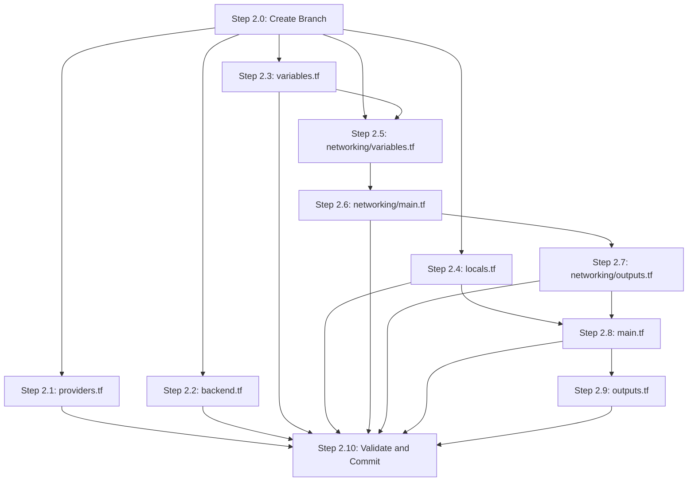

# Phase 2: Networking Module -- Execution Plan

## Prerequisites (from Phase 1, planned elsewhere)

Phase 2's code can be **written and validated** without Phase 1 being applied, using `terraform init -backend=false`. However, full `terraform init` (with backend) requires:

- S3 state bucket exists (name: `melio-devops-dev-tfstate-542088537418`, account ID confirmed via `aws sts get-caller-identity`)
- DynamoDB lock table exists (name: `melio-devops-dev-terraform-locks`) -- added in Phase 2 after discovering `use_lockfile` is OpenTofu-only
- State bucket in **af-south-1** per the [main plan](.cursor/plans/melio_iac_assessment_plan_349f73ef.plan.md)
- Terraform >= 1.9 installed (v1.14.8 confirmed)

**Assumption**: Bootstrap bucket/table names follow the `${project_name}-${environment}-*` convention. If Phase 1 uses different names, `backend.tf` values must be updated to match.

---

## Gaps and Design Considerations Found in Original Phase 2 Spec

### Gaps (missing from original)

- **Backend `profile` parameter**: The S3 backend block also needs `profile = "charteracademy"` since the AWS credentials are profile-based, not environment-variable-based. Without this, `terraform init` will fail unless `AWS_PROFILE` is exported.
- **Root `variables.tf` scope**: The original spec only mentions networking-related config, but root `variables.tf` should declare ALL variables referenced in `terraform.tfvars.example` (region, project_name, environment, instance_type, aws_profile, ssh_cidr). Later phases will add module calls that reference these. Declaring them now avoids `terraform validate` failures in subsequent phases.
- **Root `outputs.tf` initial scope**: Not specified in Phase 2 -- should include networking-related outputs (vpc_id, subnet_ids) for debugging and downstream module references.
- **`terraform init -backend=false` workflow**: If Phase 1 bootstrap hasn't been applied yet, we still need to generate `.terraform.lock.hcl` (which per cursor rules MUST be committed). Using `-backend=false` installs providers and generates the lock file without requiring the S3 bucket.
- **Single vs dual route table**: The plan says "route tables" (plural) but a single route table shared by both subnets is simpler and correct for identically-routed public subnets.
- **`map_public_ip_on_launch`**: Critical for EC2 instances to get public IPs. Not explicitly mentioned in the original spec but required since we use public subnets without Elastic IPs.
- **Subnet `Name` tags**: `default_tags` handles Project/Environment/ManagedBy, but each subnet needs a distinct `Name` tag to differentiate AZ-a from AZ-b in the AWS console.

### Design Validations (via Perplexity + Context7)

- **No breaking changes** in AWS provider 6.x for `aws_vpc`, `aws_subnet`, `aws_internet_gateway`, `aws_route_table`, `aws_route_table_association` -- syntax is identical to provider 5.x.
- **`enable_dns_support` and `enable_dns_hostnames`** remain valid on `aws_vpc` in provider 6.x (both default to `true` but should be explicit for clarity).
- **`default_tags` block** syntax confirmed: nested under `provider "aws"`, not under `terraform {}`. Resource-level `Name` tags merge with provider-level default tags.
- **S3 backend** uses DynamoDB for state locking. `use_lockfile = true` is an **OpenTofu-only feature** (widely misattributed to Terraform in blog posts). Verified via official HashiCorp GitHub releases -- not available in any Terraform version including v1.14.8. DynamoDB lock table added to bootstrap in Phase 2.
- **`terraform {}` blocks can be split across files** (providers.tf + backend.tf) -- Terraform merges them. No conflicts as long as no setting is duplicated.

### Discrepancy Between Plans

The [revised plan](.cursor/plans/melio_iac_assessment_revised_f90c4ee2.plan.md) places state + artifact buckets in **us-east-1**. The [original plan](.cursor/plans/melio_iac_assessment_plan_349f73ef.plan.md) places them in **af-south-1**. This execution plan follows the original (af-south-1 for everything). If Phase 1 changes this, only `backend.tf` region needs updating.

---

## Branch Strategy

```
Feature/Iac-implementation (current HEAD: d4f9210)
  └── feature/phase-2-networking (new, branched from current HEAD)
```

Create: `git checkout -b feature/phase-2-networking`

Phase 2 work is committed to this branch, then merged back to `Feature/Iac-implementation` when validated.

---

## Execution Steps

### Step 2.0: Create Feature Branch (~1 min)

- `git checkout -b feature/phase-2-networking` from current `Feature/Iac-implementation`
- Verify clean working tree first

### Step 2.1: Root `providers.tf` (~2 min)

**File**: [terraform/providers.tf](terraform/providers.tf) (currently empty)

Content:
- `terraform {}` block with `required_version = ">= 1.9"` and `required_providers` for AWS `~> 6.0`
- `provider "aws"` block with `profile = var.aws_profile`, `region = var.region`, and `default_tags` block containing Project, Environment, ManagedBy tags per [terraform.mdc](.cursor/rules/terraform.mdc) convention

**Key detail**: The `default_tags` block uses `var.project_name`, `var.environment` (defined in Step 2.3). `ManagedBy` is the literal `"terraform"`.

### Step 2.2: Root `backend.tf` (~2 min)

**File**: [terraform/backend.tf](terraform/backend.tf) (currently empty)

Content:
- `terraform { backend "s3" { ... } }` block
- Hardcoded values (Terraform backend blocks do NOT support variable interpolation):
  - `bucket = "melio-devops-dev-tfstate-<account-id>"` (actual account ID filled after Phase 1 bootstrap apply)
  - `key = "infrastructure/terraform.tfstate"`
  - `region = "af-south-1"`
  - `encrypt = true`
  - `use_lockfile = true` (native S3 locking, no DynamoDB needed)
  - `profile = "charteracademy"`

**Rationale for hardcoded values**: Terraform backend configuration is a known limitation -- it only accepts literals or `-backend-config` CLI flags. Hardcoding with clear naming matching the Phase 1 bootstrap convention is simplest for a demo. A comment in the file documents this constraint and references the bootstrap module.

**Note**: The bucket name includes the AWS account ID (appended by Phase 1 bootstrap via `data.aws_caller_identity`). After `terraform apply` in bootstrap, run `terraform output state_bucket_name` to get the exact value for this field.

### Step 2.3: Root `variables.tf` (~3 min)

**File**: [terraform/variables.tf](terraform/variables.tf) (currently empty)

Declares ALL root-level variables (not just networking) so `terraform validate` succeeds and `terraform.tfvars.example` aligns:

- `region` (string, default `"af-south-1"`, validation: `contains(["af-south-1", "us-east-1"], var.region)`)
- `project_name` (string, default `"melio-devops"`)
- `environment` (string, default `"dev"`)
- `aws_profile` (string, default `"charteracademy"`)
- `instance_type` (string, default `"t3.small"`) -- used by Phase 4 compute
- `ssh_cidr` (string, default `""`) -- used by Phase 3 security

Each variable has `description`, `type`, and `validation` where appropriate per [terraform.mdc](.cursor/rules/terraform.mdc).

### Step 2.4: Root `locals.tf` (~1 min)

**File**: [terraform/locals.tf](terraform/locals.tf) (currently empty)

Content:
- `local.name_prefix = "${var.project_name}-${var.environment}"` -- used by all modules for resource naming

### Step 2.5: Networking Module `variables.tf` (~2 min)

**File**: [terraform/modules/networking/variables.tf](terraform/modules/networking/variables.tf) (currently empty)

Module input variables:
- `name_prefix` (string, required, no default) -- passed from root `local.name_prefix`
- `vpc_cidr` (string, default `"10.0.0.0/16"`)
- `public_subnet_cidrs` (list(string), default `["10.0.1.0/24", "10.0.2.0/24"]`)
- `availability_zones` (list(string), default `["af-south-1a", "af-south-1b"]`)

**Design decision**: Defaults are set in the module for standalone testability. Root `main.tf` can override them (especially `availability_zones` to be region-dynamic).

### Step 2.6: Networking Module `main.tf` (~5 min)

**File**: [terraform/modules/networking/main.tf](terraform/modules/networking/main.tf) (currently empty)

Resources (in dependency order):

1. **`aws_vpc.main`** -- CIDR `var.vpc_cidr`, `enable_dns_support = true`, `enable_dns_hostnames = true`, Name tag `"${var.name_prefix}-vpc"`
2. **`aws_subnet.public[0]`** and **`aws_subnet.public[1]`** -- using `count = length(var.public_subnet_cidrs)`, each with `vpc_id`, `cidr_block = var.public_subnet_cidrs[count.index]`, `availability_zone = var.availability_zones[count.index]`, `map_public_ip_on_launch = true`, Name tag `"${var.name_prefix}-public-${var.availability_zones[count.index]}"`
3. **`aws_internet_gateway.main`** -- attached to VPC via `vpc_id`, Name tag `"${var.name_prefix}-igw"`
4. **`aws_route_table.public`** -- single route table for both subnets, with inline `route { cidr_block = "0.0.0.0/0", gateway_id = aws_internet_gateway.main.id }`, Name tag `"${var.name_prefix}-public-rt"`
5. **`aws_route_table_association.public[0]`** and **`[1]`** -- using `count`, associating each subnet with the public route table

**Design decisions**:
- **Single route table** shared by both subnets (both need identical routing: `0.0.0.0/0` -> IGW)
- **`count` over `for_each`**: Simpler for a fixed-size list of 2 subnets. The index maps cleanly (0 = AZ-a for compute, 1 = AZ-b for ALB). `for_each` with a map would be cleaner at scale but overkill for 2 subnets in a demo.
- **Inline route** in `aws_route_table`: Acceptable for a single route; separate `aws_route` resource would be preferred if routes are dynamic or managed by multiple teams.

### Step 2.7: Networking Module `outputs.tf` (~2 min)

**File**: [terraform/modules/networking/outputs.tf](terraform/modules/networking/outputs.tf) (currently empty)

Outputs (consumed by downstream modules in Phases 3-5):
- `vpc_id` -- used by security groups (Phase 3), EC2 instances (Phase 4), ALB (Phase 5)
- `public_subnet_ids` -- list of all public subnet IDs (used by ALB for multi-AZ)
- `public_subnet_a_id` -- `aws_subnet.public[0].id` -- where all 3 EC2 instances will be placed (Phase 4)
- `public_subnet_b_id` -- `aws_subnet.public[1].id` -- ALB requires presence in 2 AZs

**Rationale for named outputs (a/b)**: Downstream modules (compute, ALB) need to reference specific subnets. The compute module places all instances in subnet-a; ALB spans both. Named outputs make the intent explicit vs. relying on list indices in root `main.tf`.

### Step 2.8: Root `main.tf` -- Wire Networking Module (~2 min)

**File**: [terraform/main.tf](terraform/main.tf) (currently empty)

Content:
- `module "networking"` block with `source = "./modules/networking"`, passing `name_prefix = local.name_prefix`, `vpc_cidr`, `public_subnet_cidrs`, `availability_zones = ["${var.region}a", "${var.region}b"]`

**Key detail**: Availability zones are constructed from `var.region` + suffix ("a"/"b") so the module is region-dynamic. If `var.region` changes to `us-east-1`, the subnets auto-adjust to `us-east-1a`/`us-east-1b`.

### Step 2.9: Root `outputs.tf` -- Networking Outputs (~1 min)

**File**: [terraform/outputs.tf](terraform/outputs.tf) (currently empty)

Phase 2 outputs (later phases will append):
- `vpc_id` -- from `module.networking.vpc_id`
- `public_subnet_ids` -- from `module.networking.public_subnet_ids`

### Step 2.10: Validate, Format, and Commit (~3 min)

Execution sequence (strictly ordered):

1. `cd terraform && terraform fmt -recursive` -- format all `.tf` files
2. `terraform init -backend=false` -- install AWS provider, generate `.terraform.lock.hcl` (does NOT require the S3 state bucket to exist)
3. `terraform validate` -- verify HCL syntax and internal consistency
4. Verify `.terraform.lock.hcl` was generated
5. `git add` all changed files including `.terraform.lock.hcl`
6. Pre-commit check: verify no secrets, no `.terraform/` directory, no `terraform.tfvars` staged
7. Commit: `feat: add networking module with VPC, subnets, and IGW`

**If Phase 1 bootstrap IS already applied**: use `terraform init` (without `-backend=false`) instead, which also configures the backend. Then optionally run `terraform plan` to preview resources.

---

## Dependency Graph



Steps 2.1-2.5 are parallelizable after branch creation. Steps 2.6-2.9 have sequential dependencies. Step 2.10 is the final gate.

---

## Resource Summary

Phase 2 creates the following Terraform-managed AWS resources (expected `terraform plan` output):

- 1 x `aws_vpc`
- 2 x `aws_subnet`
- 1 x `aws_internet_gateway`
- 1 x `aws_route_table`
- 2 x `aws_route_table_association`

**Total: 7 resources**

---

## Files Modified (Phase 2 Deliverables)

| File | Action | Size Estimate |
|------|--------|---------------|
| `terraform/providers.tf` | Populated (was empty) | ~15 lines |
| `terraform/backend.tf` | Populated (was empty) | ~15 lines |
| `terraform/variables.tf` | Populated (was empty) | ~45 lines |
| `terraform/locals.tf` | Populated (was empty) | ~5 lines |
| `terraform/main.tf` | Populated (was empty) | ~10 lines |
| `terraform/outputs.tf` | Populated (was empty) | ~12 lines |
| `terraform/modules/networking/variables.tf` | Populated (was empty) | ~25 lines |
| `terraform/modules/networking/main.tf` | Populated (was empty) | ~55 lines |
| `terraform/modules/networking/outputs.tf` | Populated (was empty) | ~20 lines |
| `.terraform.lock.hcl` | Generated by `terraform init` | Auto-generated |

---

## Potential Issues to Watch For

- **Backend bucket name mismatch**: Phase 1 bootstrap includes the AWS account ID in bucket names (`melio-devops-dev-tfstate-<account-id>`). After bootstrap apply, run `terraform output state_bucket_name` to get the exact name for `backend.tf`. If the name doesn't match, `terraform init` will fail.
- **`terraform init` vs `-backend=false`**: If the backend bucket doesn't exist yet, `terraform init` (without the flag) fails. Use `-backend=false` to still validate and generate the lock file.
- **Provider download in af-south-1**: Provider binaries are downloaded from HashiCorp's CDN, not from the AWS region. No issue, but may be slightly slower from Cape Town.
- **`default_tags` and `Name` tag interaction**: Resources get both default tags (Project, Environment, ManagedBy) AND explicit Name tags. These merge correctly -- `tags_all` contains both. No conflicts.

---

## Flags for Subsequent Phases

- **Phase 3 (Security)** will consume `module.networking.vpc_id` for security group `vpc_id` arguments
- **Phase 4 (Compute)** will consume `module.networking.public_subnet_a_id` for instance placement
- **Phase 5 (ALB)** will consume `module.networking.public_subnet_ids` for ALB multi-AZ subnet mapping
- Root `main.tf` will grow with each phase as new `module` blocks are added
- Root `outputs.tf` will grow as each module exposes new outputs (ALB DNS, instance IPs, etc.)

---

## Tools and MCPs Used

- **Context7 MCP** (`resolve-library-id`, `query-docs`): Retrieved AWS provider 6.x documentation for `aws_vpc`, `aws_subnet`, `aws_internet_gateway`, `aws_route_table`, `aws_route_table_association`, `default_tags` configuration, and provider block syntax
- **Perplexity MCP** (`perplexity_ask`): Validated no breaking changes in provider 6.x for VPC/networking resources, confirmed `enable_dns_support`/`enable_dns_hostnames` still valid, verified S3 backend syntax with `use_lockfile = true` (DynamoDB deprecated), validated `terraform {}` block merging across files
- **Codebase exploration** (Task subagents): Full inventory of current file states, git history, Phase 1 status verification
- **Built-in tools**: Read (plans, rules, tfvars.example), Glob (MCP schemas)