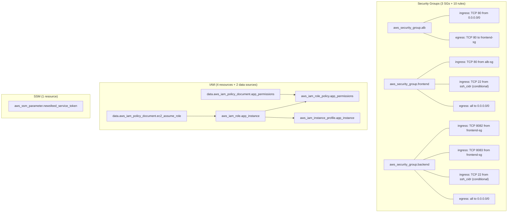

# Phase 3: Security Groups and IAM -- Execution Plan

## Prerequisites (Must Be True Before Starting)

Phase 3 depends on outputs from Phases 1 and 2. The validation step (3.0) confirms these exist before writing any security code.

- **Phase 1 complete**: Bootstrap applied in af-south-1 -- S3 state bucket (native locking via `use_lockfile`), S3 artifact bucket exist
- **Phase 2 complete**: Networking module implemented and wired -- VPC, 2 public subnets, IGW, route tables; `module.networking.vpc_id` is a valid output
- **Root scaffolding**: `providers.tf`, `backend.tf`, `variables.tf`, `locals.tf` populated (Phase 2 deliverables)
- **Terraform init**: `terraform init` succeeds in `terraform/` directory

---

## Step 3.0: Pre-flight Validation and Branch Creation (~5 min)

**Purpose**: Verify Phases 1+2 are correctly implemented before writing security code. Catch misalignments early.

### Validation Checklist

1. **Verify networking module outputs** -- `terraform/modules/networking/outputs.tf` must expose at minimum:
   - `vpc_id` (string)
   - Verify it is referenced correctly in root `terraform/main.tf` as `module.networking.vpc_id`

2. **Verify root module state** -- these files must be populated (not empty):
   - `terraform/providers.tf` -- AWS provider ~> 6.0, `default_tags`, profile, region
   - `terraform/backend.tf` -- S3 backend in af-south-1
   - `terraform/variables.tf` -- at minimum: `region`, `project_name`, `environment`, `aws_profile`, `instance_type`, `ssh_cidr`
   - `terraform/locals.tf` -- `local.name_prefix` computed as `"${var.project_name}-${var.environment}"`
   - `terraform/main.tf` -- networking module call present

3. **Verify bootstrap outputs are accessible** -- the S3 artifact bucket ARN must be known (from bootstrap apply output). This is passed as a root variable.

4. **Run `terraform validate`** -- confirm current state is valid before adding security module

### Branch Creation

```bash
git checkout Feature/Iac-implementation
git pull origin Feature/Iac-implementation  # sync if needed
git checkout -b feature/phase-3-security-iam
```

### Alignment Fixes

If any of the above checks fail, fix them before proceeding. Common issues:
- Missing `vpc_id` output from networking module -- add it
- Missing `name_prefix` local -- add it to `locals.tf`
- Root `variables.tf` missing `ssh_cidr` -- add it (already in `terraform.tfvars.example`)

---

## Step 3.1: Security Module Variables (`terraform/modules/security/variables.tf`) (~3 min)

**Purpose**: Define the module interface -- what inputs the security module requires from the root module.

### Variables to Define

- `vpc_id` (string, required) -- VPC ID for security group creation
- `name_prefix` (string, required) -- resource naming prefix (e.g., `melio-devops-dev`)
- `artifact_bucket_arn` (string, required) -- S3 artifact bucket ARN for IAM policy
- `newsfeed_service_token` (string, sensitive, required) -- token value for SSM SecureString
- `ssh_cidr` (string, default `""`) -- CIDR for optional SSH access; empty string disables SSH rules

### Design Notes

- `ssh_cidr` defaults to empty string (not `null`) so the conditional `count = var.ssh_cidr != "" ? 1 : 0` works cleanly on SSH rule resources
- `newsfeed_service_token` marked `sensitive = true` to prevent console/log exposure
- No `tags` variable needed -- `default_tags` on the provider handles Project, Environment, ManagedBy

---

## Step 3.2: Security Module Main (`terraform/modules/security/main.tf`) (~12 min)

**Purpose**: Implement all security resources. This is the core of Phase 3.

### Resource Inventory (17 resources + 3 data sources)



### Data Sources

- `data.aws_region.current` -- for constructing SSM parameter ARN pattern in IAM policy
- `data.aws_caller_identity.current` -- for account ID in SSM ARN pattern

### Security Groups Implementation Pattern

Use `aws_security_group` (base, no inline rules) + separate `aws_vpc_security_group_ingress_rule` / `aws_vpc_security_group_egress_rule` resources. This is the **recommended pattern for AWS provider ~> 6.0** per HashiCorp docs (confirmed via Context7). Avoids circular dependency issues and allows granular management.

**Key syntax** (verified via Context7):
- `security_group_id` = the SG this rule belongs to
- `referenced_security_group_id` = the source/destination SG being referenced
- `ip_protocol = "-1"` = all protocols (no `from_port`/`to_port` needed)
- `count` on SSH rules for conditional creation

### ALB Security Group

| Resource | Type | Key Attributes |
|---|---|---|
| `aws_security_group.alb` | Base SG | `name = "${var.name_prefix}-alb-sg"`, `vpc_id` |
| `aws_vpc_security_group_ingress_rule.alb_http_in` | Ingress | TCP 80 from `cidr_ipv4 = "0.0.0.0/0"` |
| `aws_vpc_security_group_egress_rule.alb_to_frontend` | Egress | TCP 80 to `referenced_security_group_id = frontend.id` |

### Frontend Security Group

| Resource | Type | Key Attributes |
|---|---|---|
| `aws_security_group.frontend` | Base SG | `name = "${var.name_prefix}-frontend-sg"`, `vpc_id` |
| `aws_vpc_security_group_ingress_rule.frontend_from_alb` | Ingress | TCP 80 from `referenced_security_group_id = alb.id` |
| `aws_vpc_security_group_ingress_rule.frontend_ssh` | Ingress (conditional) | TCP 22 from `cidr_ipv4 = var.ssh_cidr`, `count = var.ssh_cidr != "" ? 1 : 0` |
| `aws_vpc_security_group_egress_rule.frontend_all_out` | Egress | All (`ip_protocol = "-1"`) to `cidr_ipv4 = "0.0.0.0/0"` |

### Backend Security Group

| Resource | Type | Key Attributes |
|---|---|---|
| `aws_security_group.backend` | Base SG | `name = "${var.name_prefix}-backend-sg"`, `vpc_id` |
| `aws_vpc_security_group_ingress_rule.backend_quotes` | Ingress | TCP 8082 from `referenced_security_group_id = frontend.id` |
| `aws_vpc_security_group_ingress_rule.backend_newsfeed` | Ingress | TCP 8083 from `referenced_security_group_id = frontend.id` |
| `aws_vpc_security_group_ingress_rule.backend_ssh` | Ingress (conditional) | TCP 22 from `cidr_ipv4 = var.ssh_cidr`, `count` conditional |
| `aws_vpc_security_group_egress_rule.backend_all_out` | Egress | All (`ip_protocol = "-1"`) to `cidr_ipv4 = "0.0.0.0/0"` |

### IAM Implementation

**Trust policy** (`data.aws_iam_policy_document.ec2_assume_role`):
- Allow `sts:AssumeRole` by `ec2.amazonaws.com` service principal

**Permissions policy** (`data.aws_iam_policy_document.app_permissions`):
- Statement 1 (S3ArtifactAccess): `s3:GetObject` on `"${var.artifact_bucket_arn}/*"`
- Statement 2 (S3ArtifactList): `s3:ListBucket` on `var.artifact_bucket_arn` -- needed for meaningful error messages from `aws s3 cp`
- Statement 3 (SSMParameterRead): `ssm:GetParameter` on `"arn:aws:ssm:${data.aws_region.current.name}:${data.aws_caller_identity.current.account_id}:parameter/app/*"`

**Role** (`aws_iam_role.app_instance`):
- Name: `"${var.name_prefix}-app-instance-role"`
- Assume role policy: EC2 trust document

**Inline policy** (`aws_iam_role_policy.app_permissions`):
- Attaches the combined S3+SSM permissions to the role
- Using inline policy (not managed) because it's tightly coupled to this specific role and simplifies the module

**Instance profile** (`aws_iam_instance_profile.app_instance`):
- Name: `"${var.name_prefix}-app-instance-profile"`
- Role: the app instance role

### SSM Parameter

**Resource** (`aws_ssm_parameter.newsfeed_service_token`):
- Name: `/app/newsfeed-service-token`
- Type: `SecureString` (encrypted with default AWS managed key `alias/aws/ssm` -- no extra KMS permissions needed)
- Value: `var.newsfeed_service_token` (sensitive)
- Tags: `Name` tag for console visibility

### Design Decisions

- **Inline policy vs managed policy**: Using `aws_iam_role_policy` (inline) rather than `aws_iam_policy` + `aws_iam_role_policy_attachment`. The policy is specific to this role and won't be reused. Simpler for a demo module.
- **Default KMS key for SSM**: Using the AWS managed key avoids creating a KMS key and simplifies IAM. The trade-off (documented in `docs/trade-offs.md`) is less control over key rotation.
- **No `aws_vpc_security_group_rules_exclusive`**: Not needed for a demo. This resource ensures no out-of-band rules exist but adds complexity.
- **Separate SG rules per port for backends**: Two rules (8082, 8083) rather than one range (8082-8083) for clarity and documentation value.

---

## Step 3.3: Security Module Outputs (`terraform/modules/security/outputs.tf`) (~2 min)

**Purpose**: Expose all IDs/ARNs that downstream modules (compute, ALB) need.

### Outputs

- `alb_security_group_id` -- consumed by ALB module (Phase 5)
- `frontend_security_group_id` -- consumed by compute module (Phase 4, frontend instance)
- `backend_security_group_id` -- consumed by compute module (Phase 4, quotes + newsfeed instances)
- `instance_profile_name` -- consumed by compute module (Phase 4, all instances)
- `iam_role_arn` -- informational, for debugging/verification
- `ssm_parameter_name` -- consumed by compute module (Phase 4, frontend user data reads token)
- `ssm_parameter_arn` -- informational, marked `sensitive = true`

---

## Step 3.4: Root Module Wiring (~5 min)

**Purpose**: Connect the security module to the root module and add required root-level variables.

### Changes to `terraform/variables.tf`

Add two new variables:

- `artifact_bucket_arn` (string, required) -- "ARN of the S3 artifact bucket (from bootstrap output)"
- `newsfeed_service_token` (string, sensitive, required) -- "Authentication token for newsfeed service (pass via -var or TF_VAR_, never in tfvars)"

### Changes to `terraform/main.tf`

Add security module block after networking module:

```hcl
module "security" {
  source = "./modules/security"

  vpc_id                 = module.networking.vpc_id
  name_prefix            = local.name_prefix
  artifact_bucket_arn    = var.artifact_bucket_arn
  newsfeed_service_token = var.newsfeed_service_token
  ssh_cidr               = var.ssh_cidr
}
```

### Changes to `terraform/outputs.tf`

Add security-related outputs that downstream phases or operators need:

- `alb_security_group_id` = `module.security.alb_security_group_id`
- `frontend_security_group_id` = `module.security.frontend_security_group_id`
- `backend_security_group_id` = `module.security.backend_security_group_id`
- `instance_profile_name` = `module.security.instance_profile_name`

### Changes to `terraform/terraform.tfvars.example`

Add:
```
artifact_bucket_arn = "arn:aws:s3:::melio-devops-dev-artifacts"
# newsfeed_service_token -- pass via CLI: terraform apply -var="newsfeed_service_token=YOUR_TOKEN"
```

---

## Step 3.5: Format, Validate, and Lint (~2 min)

1. `terraform fmt -recursive terraform/` -- auto-format all files
2. `terraform validate` in `terraform/` -- confirm config is syntactically valid
3. Check linter errors on all edited `.tf` files
4. Review for adherence to cursor rules (`terraform.mdc`, `project.mdc`)

---

## Step 3.6: Commit (~1 min)

**Message**: `feat: add security groups, IAM roles, and SSM secret`

### Files in Commit

- `terraform/modules/security/main.tf` (new content)
- `terraform/modules/security/variables.tf` (new content)
- `terraform/modules/security/outputs.tf` (new content)
- `terraform/main.tf` (modified -- security module block added)
- `terraform/variables.tf` (modified -- 2 new variables)
- `terraform/outputs.tf` (modified -- security outputs added)
- `terraform/terraform.tfvars.example` (modified -- artifact_bucket_arn + token comment)

### Pre-commit Checks

- No secrets in staged files (the token value is NOT in any file; it's a variable reference)
- `terraform fmt` clean (no diff)
- `terraform validate` passes
- Conventional commit format

---

## Gaps, Risks, and Mitigations

### Identified and Addressed

- **SG circular reference**: ALB egress references frontend SG, frontend ingress references ALB SG. Resolved by using standalone rule resources (not inline) -- Terraform handles the dependency graph correctly with `aws_vpc_security_group_ingress_rule` / `aws_vpc_security_group_egress_rule`.
- **SSH conditional**: SSH rules use `count` to avoid creating rules when `ssh_cidr` is empty. Prevents accidental open SSH.
- **S3 ListBucket**: Added `s3:ListBucket` alongside `s3:GetObject` -- without it, `aws s3 cp` returns "Access Denied" instead of "Not Found" on missing objects, making debugging harder.
- **SSM ARN scoping**: IAM policy uses `data.aws_region.current` and `data.aws_caller_identity.current` to construct the ARN pattern, ensuring it's region-and-account-scoped (not wildcard).
- **KMS for SecureString**: Default AWS managed key means no extra `kms:Decrypt` permission needed in IAM policy. If a customer-managed key were used, explicit KMS permissions would be required.
- **State sensitivity**: SSM parameter value will be in Terraform state (S3, encrypted). This is a known Terraform limitation. Documented as a trade-off.

### Potential Issues to Watch

- **IAM propagation delay**: After `terraform apply`, IAM role/instance profile may take 5-10 seconds to propagate. EC2 instances launched immediately after may fail initial S3/SSM calls. The retry loop in user data (Phase 4) handles this.
- **SSM parameter name must match user data**: Frontend user data will read `/app/newsfeed-service-token` via `aws ssm get-parameter`. The exact name must match between this module's output and the compute module's template variable.
- **Provider default_tags**: Security groups, IAM role, and SSM parameter will inherit `Project`, `Environment`, `ManagedBy` tags from the provider. The explicit `Name` tag on SGs is additive.

---

## Downstream Interface Contract

Phase 3 outputs are consumed by Phases 4 and 5. This is the contract:

| Output | Consumer | Phase |
|---|---|---|
| `alb_security_group_id` | ALB module (`vpc_security_group_ids`) | Phase 5 |
| `frontend_security_group_id` | Compute module (frontend `vpc_security_group_ids`) | Phase 4 |
| `backend_security_group_id` | Compute module (quotes + newsfeed `vpc_security_group_ids`) | Phase 4 |
| `instance_profile_name` | Compute module (all 3 instances `iam_instance_profile`) | Phase 4 |
| `ssm_parameter_name` | Compute module (frontend user data `templatefile()` variable) | Phase 4 |

---

## Tools and MCPs Used

- **Context7 MCP** (`resolve-library-id`, `query-docs`): Retrieved AWS provider ~> 6.0 documentation for `aws_vpc_security_group_ingress_rule`, `aws_vpc_security_group_egress_rule`, `aws_iam_role`, `aws_iam_instance_profile`, `aws_iam_role_policy`, `aws_ssm_parameter` -- confirmed `referenced_security_group_id` attribute name and standalone rule pattern
- **Perplexity MCP** (`perplexity_ask`): Validated security group cross-reference best practices for provider v6.x, confirmed no breaking changes to SG resources in v6, confirmed `aws_ssm_parameter` SecureString syntax unchanged
- **Codebase exploration subagents**: Full directory tree, all existing file contents, git branch/log state, cursor rules, docs templates
- **Built-in tools**: Read (plans, rules, module files), Shell (git status/log/branch), Glob (file discovery)