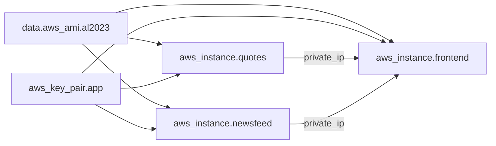

# Phase 4: Compute Module Execution Plan

## Prerequisites and Assumptions

Phase 4 depends on outputs from Phases 1-3. Before writing any compute code, the plan includes a quality gate to verify those foundations are sound.

**Expected inputs from prior phases:**
- Networking: `subnet_id` (AZ-a), `vpc_id`
- Security: `frontend_sg_id`, `backend_sg_id`, `instance_profile_name`
- Root config: `artifact_bucket` name, `ssm_parameter_name` (`/app/newsfeed-service-token`), `region`
- Root providers.tf: AWS provider `~> 6.0` with `default_tags`

---

## Step 0: Quality Verification of Phases 1-3

Before creating the branch, run a quality audit on the existing `Feature/Iac-implementation` code.

**Checks to perform:**
- `terraform fmt -check -recursive` in `terraform/` -- flag formatting violations
- `terraform validate` in `terraform/` -- catch syntax/reference errors
- Verify [terraform/modules/networking/outputs.tf](terraform/modules/networking/outputs.tf) exports `subnet_a_id` (or equivalent) and `vpc_id`
- Verify [terraform/modules/security/outputs.tf](terraform/modules/security/outputs.tf) exports `frontend_sg_id`, `backend_sg_id`, `instance_profile_name`
- Verify [terraform/main.tf](terraform/main.tf) wires networking and security modules, passing outputs correctly
- Verify [terraform/providers.tf](terraform/providers.tf) has `default_tags` block and version constraints (`>= 1.9`, `~> 6.0`)
- Verify [terraform/variables.tf](terraform/variables.tf) defines `region`, `project_name`, `environment`, `instance_type`, `aws_profile`
- Verify [terraform/locals.tf](terraform/locals.tf) defines `name_prefix`
- Spot-check: security group rules match the matrix in the master plan (ALB SG -> frontend SG port 80, frontend SG -> backend SG ports 8082/8083)
- Confirm `artifact_bucket` name is available as a root variable or local

**If issues are found:** Document them and fix before proceeding. Do not layer Phase 4 on a broken foundation.

---

## Step 1: Create Feature Branch

```
git checkout Feature/Iac-implementation
git pull origin Feature/Iac-implementation
git checkout -b feature/phase-4-compute
```

All Phase 4 work happens on this branch. Commit message at end: `feat: add compute module with 3 EC2 instances and user data`

---

## Step 2: Add TLS Provider to Root Providers

**File:** [terraform/providers.tf](terraform/providers.tf)

Add `hashicorp/tls ~> 4.0` to the `required_providers` block. This is needed for the `tls_private_key` resource that generates the SSH key pair for the demo.

**Why in root, not module?** Terraform best practice: provider requirements are declared at the root module level. Modules inherit providers from their callers.

---

## Step 3: Compute Module -- variables.tf

**File:** [terraform/modules/compute/variables.tf](terraform/modules/compute/variables.tf)

Define all inputs the module needs. Every variable gets `description`, `type`, and `validation` where appropriate (per [.cursor/rules/terraform.mdc](.cursor/rules/terraform.mdc)).

**Variables to declare:**

| Variable | Type | Source | Purpose |
|---|---|---|---|
| `name_prefix` | `string` | `local.name_prefix` | Resource naming |
| `subnet_id` | `string` | networking module | Subnet AZ-a for all 3 instances |
| `frontend_sg_ids` | `list(string)` | security module | SGs for frontend EC2 |
| `backend_sg_ids` | `list(string)` | security module | SGs for quotes + newsfeed EC2s |
| `instance_profile_name` | `string` | security module | IAM instance profile (S3 + SSM access) |
| `instance_type` | `string` (default `"t3.small"`) | root var | EC2 instance size |
| `artifact_bucket` | `string` | root var/local | S3 bucket with JARs and static.tgz |
| `ssm_parameter_name` | `string` (default `"/app/newsfeed-service-token"`) | root var/local | SSM path for NEWSFEED_SERVICE_TOKEN |
| `region` | `string` | root var | Needed for SSM CLI call in user data |
| `frontend_port` | `number` (default `8080`) | -- | JAR listen port |
| `quotes_port` | `number` (default `8082`) | -- | JAR listen port |
| `newsfeed_port` | `number` (default `8083`) | -- | JAR listen port |

---

## Step 4: User Data Templates

All templates follow conventions in [.cursor/rules/user-data.mdc](.cursor/rules/user-data.mdc): `set -euxo pipefail`, `dnf` (not yum), S3 retry loop, JVM heap flags, systemd, completion log.

### 4a: nginx.conf.tpl

**File:** [terraform/modules/compute/templates/nginx.conf.tpl](terraform/modules/compute/templates/nginx.conf.tpl)

**Rendered separately** via `templatefile()` and passed as a variable to `frontend.sh.tpl`. This avoids double-escaping issues between Terraform template syntax and nginx `$variable` syntax.

**Content design:**
- `listen 80;` with `server_name _;`
- `location /css/` -- `alias /opt/app/static/css/;` serves extracted static.tgz content
- `location /` -- `proxy_pass http://127.0.0.1:${frontend_port};` with standard proxy headers

**Escaping note:** nginx variables (`$host`, `$remote_addr`, `$proxy_add_x_forwarded_for`) do NOT use `${...}` syntax, so Terraform's `templatefile()` passes them through untouched. Only `${frontend_port}` is interpolated by Terraform.

### 4b: quotes.sh.tpl

**File:** [terraform/modules/compute/templates/quotes.sh.tpl](terraform/modules/compute/templates/quotes.sh.tpl)

**Template variables:** `artifact_bucket`, `quotes_port`

**Script flow:**
1. `dnf install -y java-17-amazon-corretto-headless`
2. `mkdir -p /opt/app`
3. S3 download with 3-attempt retry: `s3://${artifact_bucket}/quotes.jar` -> `/opt/app/quotes.jar`
4. Write environment file `/opt/app/quotes.env` with `APP_PORT=${quotes_port}`
5. Write systemd unit `/etc/systemd/system/quotes.service` with `EnvironmentFile=/opt/app/quotes.env`, `ExecStart=java -Xmx512m -XX:+UseSerialGC -jar /opt/app/quotes.jar`, `Restart=on-failure`
6. `systemctl daemon-reload && systemctl enable --now quotes`
7. Completion log via `systemd-cat`

**Design choice -- EnvironmentFile vs inline Environment=:** Using `EnvironmentFile` is more robust with special characters and easier to debug on the instance (`cat /opt/app/quotes.env`).

### 4c: newsfeed.sh.tpl

**File:** [terraform/modules/compute/templates/newsfeed.sh.tpl](terraform/modules/compute/templates/newsfeed.sh.tpl)

**Template variables:** `artifact_bucket`, `newsfeed_port`

**Script flow:** Identical pattern to quotes.sh.tpl but with `newsfeed.jar`, `newsfeed_port` (8083), and service name `newsfeed`.

### 4d: frontend.sh.tpl

**File:** [terraform/modules/compute/templates/frontend.sh.tpl](terraform/modules/compute/templates/frontend.sh.tpl)

**Template variables:** `artifact_bucket`, `frontend_port`, `quotes_private_ip`, `quotes_port`, `newsfeed_private_ip`, `newsfeed_port`, `ssm_parameter_name`, `region`, `nginx_conf`

**Script flow (most complex):**
1. `dnf install -y java-17-amazon-corretto-headless nginx`
2. `mkdir -p /opt/app/static`
3. S3 download `front-end.jar` with retry
4. S3 download `static.tgz` with retry, extract to `/opt/app/static/` (produces `/opt/app/static/css/bootstrap.min.css`)
5. Read `NEWSFEED_SERVICE_TOKEN` from SSM: `aws ssm get-parameter --name ${ssm_parameter_name} --with-decryption --query 'Parameter.Value' --output text --region ${region}`
6. Write environment file `/opt/app/frontend.env`:
   - `APP_PORT` = Terraform-injected `frontend_port`
   - `STATIC_URL` = `""` (empty -- nginx serves CSS at `/css/*`)
   - `QUOTE_SERVICE_URL` = `http://${quotes_private_ip}:${quotes_port}` (Terraform-injected)
   - `NEWSFEED_SERVICE_URL` = `http://${newsfeed_private_ip}:${newsfeed_port}` (Terraform-injected)
   - `NEWSFEED_SERVICE_TOKEN` = bash variable from SSM read (resolved at boot time, NOT in Terraform)
7. Write systemd unit `/etc/systemd/system/frontend.service` with `EnvironmentFile=/opt/app/frontend.env`
8. Write nginx config from the pre-rendered `nginx_conf` variable: `echo '${nginx_conf}' > /etc/nginx/conf.d/frontend.conf`
9. Remove default nginx site config if present
10. `systemctl daemon-reload && systemctl enable --now frontend nginx`
11. Completion log

**Critical escaping detail:** The `NEWSFEED_SERVICE_TOKEN` line in the env file heredoc must use bash `$$NEWSFEED_TOKEN` in the Terraform template (double `$$` produces literal `$` after Terraform processing, which bash then expands to the SSM value). All other `${...}` variables in the env file heredoc are Terraform-interpolated at plan time.

---

## Step 5: Compute Module -- main.tf

**File:** [terraform/modules/compute/main.tf](terraform/modules/compute/main.tf)

### 5a: AL2023 AMI Data Source

`data "aws_ami" "al2023"` with:
- `most_recent = true`
- `owners = ["amazon"]`
- Filter `name` = `"al2023-ami-2023*-x86_64"` (matches all AL2023 x86_64 AMIs)
- Filter `architecture` = `"x86_64"`
- Filter `virtualization-type` = `"hvm"`

This is region-agnostic per [.cursor/rules/terraform.mdc](.cursor/rules/terraform.mdc) (never hardcode AMI IDs).

### 5b: TLS Private Key + Key Pair

- `tls_private_key.ssh`: algorithm `RSA`, 4096 bits
- `aws_key_pair.app`: key_name `"${var.name_prefix}-key"`, public_key from tls_private_key

**Note in code comment:** Production should use pre-existing keys or SSM Session Manager, not Terraform-generated keys (private key ends up in state).

### 5c: Render nginx.conf via templatefile

Use a `locals` block to render nginx.conf.tpl separately:

```
locals {
  nginx_conf = templatefile("${path.module}/templates/nginx.conf.tpl", {
    frontend_port = var.frontend_port
  })
}
```

### 5d: Quotes EC2 Instance

`aws_instance.quotes`:
- `ami` = `data.aws_ami.al2023.id`
- `instance_type` = `var.instance_type`
- `subnet_id` = `var.subnet_id`
- `vpc_security_group_ids` = `var.backend_sg_ids`
- `iam_instance_profile` = `var.instance_profile_name`
- `key_name` = `aws_key_pair.app.key_name`
- `associate_public_ip_address` = `true` (public subnet, needed for S3/SSM access without NAT)
- `user_data` = `templatefile("${path.module}/templates/quotes.sh.tpl", { artifact_bucket = var.artifact_bucket, quotes_port = var.quotes_port })`
- `user_data_replace_on_change` = `true`
- `tags` = `{ Name = "${var.name_prefix}-quotes" }`

### 5e: Newsfeed EC2 Instance

`aws_instance.newsfeed`: Same pattern as quotes, with `newsfeed.sh.tpl`, `newsfeed_port`, and Name tag `-newsfeed`.

### 5f: Frontend EC2 Instance

`aws_instance.frontend`:
- Same base config as above but with `var.frontend_sg_ids`
- `user_data` = `templatefile("${path.module}/templates/frontend.sh.tpl", { ... })` with all frontend variables including `quotes_private_ip = aws_instance.quotes.private_ip`, `newsfeed_private_ip = aws_instance.newsfeed.private_ip`, and `nginx_conf = local.nginx_conf`
- This creates an **implicit dependency**: Terraform creates quotes and newsfeed first (to resolve their private IPs), then creates frontend. This is correct and intentional.
- `tags` = `{ Name = "${var.name_prefix}-frontend" }`

**Dependency order (automatic via private_ip references):**



---

## Step 6: Compute Module -- outputs.tf

**File:** [terraform/modules/compute/outputs.tf](terraform/modules/compute/outputs.tf)

**Outputs to expose:**
- `frontend_instance_id` -- needed by ALB module (Phase 5) for target group registration
- `frontend_private_ip` -- for debugging/docs
- `frontend_public_ip` -- fallback access if ALB not yet deployed
- `quotes_private_ip` -- for debugging
- `newsfeed_private_ip` -- for debugging
- `quotes_public_ip`, `newsfeed_public_ip` -- for SSH debugging
- `key_pair_name` -- for reference
- `private_key_pem` -- marked `sensitive = true`, for SSH access during demo

---

## Step 7: Root Module Wiring

### 7a: Add compute module block to [terraform/main.tf](terraform/main.tf)

Wire the compute module after networking and security modules:

```
module "compute" {
  source = "./modules/compute"
  
  name_prefix           = local.name_prefix
  subnet_id             = module.networking.subnet_a_id
  frontend_sg_ids       = [module.security.frontend_sg_id]
  backend_sg_ids        = [module.security.backend_sg_id]
  instance_profile_name = module.security.instance_profile_name
  instance_type         = var.instance_type
  artifact_bucket       = var.artifact_bucket
  ssm_parameter_name    = var.ssm_parameter_name
  region                = var.region
}
```

**Note:** The exact output names from networking/security modules depend on Phase 2-3 implementation. The Step 0 quality check verifies these names match.

### 7b: Add root variables if missing

Check [terraform/variables.tf](terraform/variables.tf) for `artifact_bucket` and `ssm_parameter_name`. If not present, add them with appropriate defaults and descriptions.

### 7c: Add compute outputs to [terraform/outputs.tf](terraform/outputs.tf)

Pass through key outputs:
- `frontend_instance_id` (needed by Phase 5 ALB)
- `frontend_public_ip`
- `ssh_private_key` (sensitive)

---

## Step 8: Validation and Commit

1. `terraform fmt -recursive terraform/`
2. `terraform validate` in `terraform/` (requires prior `terraform init`)
3. Review all template files for escaping correctness (Terraform `${...}` vs bash `$VAR` vs nginx `$var`)
4. Verify `.gitignore` excludes `*.pem` files (already in Phase 0 scaffold)
5. Commit: `feat: add compute module with 3 EC2 instances and user data`

---

## Potential Issues and Mitigations

| Issue | Risk | Mitigation |
|---|---|---|
| **Template escaping bugs** (Terraform `${}` vs bash `$` vs nginx `$`) | User data produces invalid script | nginx.conf rendered separately; EnvironmentFile approach avoids inline quoting; `$$` used only where bash needs `${...}` syntax |
| **Boot ordering** (frontend starts before backends respond) | First page load shows errors | `/ping` health check is independent of backends; browser refresh after 30-60s resolves; ALB health check handles this at LB level |
| **SSM read fails** (IAM policy too narrow, region mismatch) | Frontend boots without token | `set -euxo pipefail` makes the script fail visibly; check `/var/log/cloud-init-output.log`; IAM policy verified in Step 0 |
| **S3 download fails** (bucket name mismatch, object missing) | Service JAR not available | 3-attempt retry loop with 10s sleep; `set -e` ensures failure is visible |
| **AMI not found in af-south-1** | `terraform plan` fails | Filter uses wildcard `al2023-ami-2023*-x86_64` which is available in all regions including af-south-1 |
| **Private key in Terraform state** | Security concern | Documented as demo-only pattern; production note to use SSM Session Manager or pre-existing keys |
| **NEWSFEED_SERVICE_TOKEN special characters** (`&`, `^`) | Breaks in bash or systemd | EnvironmentFile approach + quoting handles special chars; single-quoted heredoc for the env file line with SSM value |
| **`user_data_replace_on_change`** | Instance destroyed on template change | Set to `true` intentionally -- ensures user data changes trigger instance replacement (correct for immutable infrastructure pattern) |

---

## File Change Summary

| File | Action | Content |
|---|---|---|
| `terraform/providers.tf` | EDIT | Add `hashicorp/tls ~> 4.0` to required_providers |
| `terraform/modules/compute/variables.tf` | CREATE (populate empty stub) | ~12 variable declarations |
| `terraform/modules/compute/main.tf` | CREATE (populate empty stub) | AMI data source, TLS key, key pair, 3 EC2 instances |
| `terraform/modules/compute/outputs.tf` | CREATE (populate empty stub) | ~8 output declarations |
| `terraform/modules/compute/templates/nginx.conf.tpl` | CREATE | nginx server block |
| `terraform/modules/compute/templates/quotes.sh.tpl` | CREATE | User data ~40 lines |
| `terraform/modules/compute/templates/newsfeed.sh.tpl` | CREATE | User data ~40 lines |
| `terraform/modules/compute/templates/frontend.sh.tpl` | CREATE | User data ~70 lines |
| `terraform/main.tf` | EDIT | Add `module "compute"` block |
| `terraform/variables.tf` | EDIT (if needed) | Add `artifact_bucket`, `ssm_parameter_name` |
| `terraform/outputs.tf` | EDIT | Add compute passthrough outputs |

**Estimated resource count added:** 5 (tls_private_key, aws_key_pair, 3x aws_instance) + 1 data source (aws_ami)

---

## Tools and Research Used

- **Perplexity MCP**: Validated AL2023 AMI data source filter syntax (`al2023-ami-2023*-x86_64`), `tls_private_key` + `aws_key_pair` pattern with RSA 4096, `templatefile()` escaping rules, AWS provider 6.0 `aws_instance` resource syntax
- **Context7 MCP**: Not used (Perplexity covered all needed syntax validation)
- **Codebase exploration (subagents)**: Full service code review (front-end, quotes, newsfeed), Makefile JAR naming, env var wiring, `/ping` endpoints, static asset structure, port defaults
- **Cursor rules**: [.cursor/rules/terraform.mdc](.cursor/rules/terraform.mdc) (naming, AMI data source, variable conventions), [.cursor/rules/user-data.mdc](.cursor/rules/user-data.mdc) (script header, dnf, retry loop, systemd, JVM flags), [.cursor/rules/project.mdc](.cursor/rules/project.mdc) (commit conventions, no secrets in VCS)
