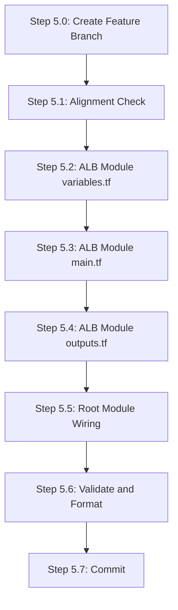

# Phase 5: Application Load Balancer -- Execution Plan

## Gaps and Flaws Identified in Original Phase 5 Specification

Before executing, these issues were found in the master plan's Phase 5 description and are resolved below:

### Gaps (missing from original)

- **No `deregistration_delay`**: AWS default is 300s -- far too long for a dev/demo environment. Should be 30s for fast iteration during testing/teardown.
- **No `unhealthy_threshold`**: Only `healthy_threshold 2` specified. Must also set `unhealthy_threshold` (recommend 3) for predictable failure detection.
- **No health check `timeout`**: Default is 5s, but should be explicit. Must be lower than `interval` (30s), so 5s is correct.
- **No health check `matcher`**: Must specify `"200"` to match the `/ping` endpoint's HTTP 200 response.
- **No `enable_deletion_protection`**: Must be `false` for a dev environment. If left at default (`false`) this is fine, but should be explicit -- otherwise `teardown.sh` in Phase 7 would fail.
- **No ALB `idle_timeout`**: Default 60s is acceptable for demo scope, but should be explicitly documented as a conscious choice.
- **Target group name length**: AWS enforces a 32-character limit on target group names. With prefix `melio-devops-dev-frontend-tg`, that's 28 chars -- safe, but must be checked.
- **Root module wiring not detailed**: The master plan says "register frontend instance in target group" but doesn't detail the root `main.tf` module block or `outputs.tf` additions.
- **No interface contract for module inputs**: The plan doesn't specify which outputs from networking/security/compute modules the ALB module consumes. These must be validated before implementation.
- **Branch strategy unspecified**: Original Phase 5 doesn't mention branching -- user requires a new feature branch.

### Design Considerations (trade-offs to document)

- **Target group attachment inside vs outside ALB module**: Placing `aws_lb_target_group_attachment` inside the ALB module keeps it self-contained; the alternative (root module) reduces coupling but adds complexity. For this single-frontend-instance demo, inside the module is correct.
- **No access logs on ALB**: S3 access log bucket not provisioned. Acceptable for dev scope; documented in `docs/future-work.md`.
- **No WAF integration**: Out of scope per master plan; documented as future work.
- **`internal = false`**: Internet-facing ALB, consistent with public-subnet-only architecture.

---

## Pre-requisite: Interface Contracts from Phases 1-4

Phase 5 consumes these outputs. The alignment check step will verify they exist with correct names and types.

### From Phase 2 (Networking module)

| Output | Type | Expected Name |
|--------|------|---------------|
| VPC ID | `string` | `module.networking.vpc_id` |
| Public subnet IDs (both AZs) | `list(string)` | `module.networking.public_subnet_ids` |

### From Phase 3 (Security module)

| Output | Type | Expected Name |
|--------|------|---------------|
| ALB security group ID | `string` | `module.security.alb_security_group_id` |

### From Phase 4 (Compute module)

| Output | Type | Expected Name |
|--------|------|---------------|
| Frontend instance ID | `string` | `module.compute.frontend_instance_id` |

---

## Execution Order



---

## Step 5.0: Create Feature Branch (~1 min)

**Purpose**: Isolate Phase 5 changes on a dedicated branch per user requirement.

**Prerequisite**: `Feature/Iac-implementation` must contain completed Phases 1-4 (bootstrap, networking, security, compute) before branching. This is the integration branch where all prior phase work has landed.

- Ensure on `Feature/Iac-implementation`: `git checkout Feature/Iac-implementation`
- Create branch from its HEAD: `git checkout -b feature/Iac-phase-5-alb`
- Verify clean working tree: `git status`

**Naming rationale**: Matches the `feature/Iac-phase-0-basic-repo-set-up` convention from Phase 0.

---

## Step 5.1: Alignment and Quality Check (~3 min)

**Purpose**: Validate that Phases 1-4 outputs match the expected interface contracts before building on top of them. Fix any misalignment.

### Checks to perform

1. **Networking module outputs** (`terraform/modules/networking/outputs.tf`):
   - Verify `vpc_id` output exists and references `aws_vpc`
   - Verify `public_subnet_ids` output exists as a list of both subnet IDs

2. **Security module outputs** (`terraform/modules/security/outputs.tf`):
   - Verify `alb_security_group_id` output exists and references the ALB security group

3. **Compute module outputs** (`terraform/modules/compute/outputs.tf`):
   - Verify `frontend_instance_id` output exists and references the frontend EC2 instance

4. **Root module** (`terraform/main.tf`):
   - Verify networking, security, and compute module blocks exist with correct source paths and variable wiring

5. **Provider and backend** (`terraform/providers.tf`, `terraform/backend.tf`):
   - Verify AWS provider ~> 6.0 with `default_tags` block is configured
   - Verify S3 backend is configured

### Remediation

- If any output names differ from expected (e.g., `alb_sg_id` instead of `alb_security_group_id`), **align the ALB module variables to match** -- do not rename existing outputs since Phases 1-4 may already be committed.
- Document any deviations found.

---

## Step 5.2: ALB Module `variables.tf` (~2 min)

**Purpose**: Define the module's input interface.

**File**: [terraform/modules/alb/variables.tf](terraform/modules/alb/variables.tf)

### Variables to define

| Variable | Type | Description | Validation |
|----------|------|-------------|------------|
| `name_prefix` | `string` | Resource name prefix (from `local.name_prefix`) | `length(var.name_prefix) > 0` |
| `vpc_id` | `string` | VPC ID for the target group | None (passed from networking module) |
| `public_subnet_ids` | `list(string)` | List of public subnet IDs for ALB placement (min 2 AZs required) | `length(var.public_subnet_ids) >= 2` |
| `alb_security_group_id` | `string` | Security group ID for the ALB | None |
| `frontend_instance_id` | `string` | Instance ID of the frontend EC2 to register in target group | None |

**Convention compliance**: Every variable has `description`, `type`, and `validation` where appropriate per `terraform.mdc` rule.

---

## Step 5.3: ALB Module `main.tf` (~5 min)

**Purpose**: Define all ALB resources.

**File**: [terraform/modules/alb/main.tf](terraform/modules/alb/main.tf)

### Resource 1: `aws_lb.main`

| Argument | Value | Rationale |
|----------|-------|-----------|
| `name` | `"${var.name_prefix}-alb"` | Follows naming convention from `terraform.mdc` |
| `internal` | `false` | Internet-facing per architecture |
| `load_balancer_type` | `"application"` | Required for HTTP routing |
| `security_groups` | `[var.alb_security_group_id]` | References the ALB SG from security module |
| `subnets` | `var.public_subnet_ids` | Both AZs (af-south-1a + af-south-1b) -- ALB requires min 2 AZs |
| `enable_deletion_protection` | `false` | **Critical for teardown** -- must be `false` for dev |

**Not included** (conscious omissions):
- `access_logs`: No S3 log bucket provisioned (future work)
- `idle_timeout`: Default 60s acceptable for demo
- `enable_zonal_shift`: New in provider 6.x, not needed for dev

### Resource 2: `aws_lb_target_group.frontend`

| Argument | Value | Rationale |
|----------|-------|-----------|
| `name` | `"${var.name_prefix}-fe-tg"` | Kept short (under 32-char AWS limit) |
| `port` | `80` | Frontend serves on port 80 (via nginx) |
| `protocol` | `"HTTP"` | HTTP-only per scope |
| `vpc_id` | `var.vpc_id` | Required for instance target type |
| `target_type` | `"instance"` | Registering EC2 instances |
| `deregistration_delay` | `30` | **Gap fix**: Reduced from 300s default for fast dev iteration |
| `health_check.enabled` | `true` | Explicit |
| `health_check.path` | `"/ping"` | Validates full nginx-to-JVM stack |
| `health_check.port` | `"80"` | Health check on the traffic port |
| `health_check.protocol` | `"HTTP"` | Match target group protocol |
| `health_check.interval` | `30` | Per master plan spec |
| `health_check.timeout` | `5` | **Gap fix**: Explicit timeout (must be < interval) |
| `health_check.healthy_threshold` | `2` | Per master plan spec |
| `health_check.unhealthy_threshold` | `3` | **Gap fix**: Not in original spec, 3 consecutive failures to mark unhealthy |
| `health_check.matcher` | `"200"` | **Gap fix**: Explicit match on HTTP 200 from `/ping` |

### Resource 3: `aws_lb_listener.http`

| Argument | Value | Rationale |
|----------|-------|-----------|
| `load_balancer_arn` | `aws_lb.main.arn` | References the ALB above |
| `port` | `80` | HTTP listener |
| `protocol` | `"HTTP"` | No TLS per scope |
| `default_action.type` | `"forward"` | Simple forward to target group |
| `default_action.target_group_arn` | `aws_lb_target_group.frontend.arn` | Single target group, no routing rules needed |

### Resource 4: `aws_lb_target_group_attachment.frontend`

| Argument | Value | Rationale |
|----------|-------|-----------|
| `target_group_arn` | `aws_lb_target_group.frontend.arn` | Attach to frontend target group |
| `target_id` | `var.frontend_instance_id` | Frontend EC2 instance from compute module |
| `port` | `80` | Traffic port |

---

## Step 5.4: ALB Module `outputs.tf` (~1 min)

**Purpose**: Expose ALB attributes for root module and validation.

**File**: [terraform/modules/alb/outputs.tf](terraform/modules/alb/outputs.tf)

| Output | Value | Description |
|--------|-------|-------------|
| `alb_dns_name` | `aws_lb.main.dns_name` | The application URL (used in README and validation) |
| `alb_arn` | `aws_lb.main.arn` | ALB ARN for reference |
| `alb_zone_id` | `aws_lb.main.zone_id` | Hosted zone ID (useful if Route53 added later) |
| `target_group_arn` | `aws_lb_target_group.frontend.arn` | Target group ARN for reference |

---

## Step 5.5: Root Module Wiring (~3 min)

**Purpose**: Connect the ALB module to the root configuration and expose the ALB DNS as a top-level output.

### File: [terraform/main.tf](terraform/main.tf)

Add the ALB module block after the existing compute module block:

```hcl
module "alb" {
  source = "./modules/alb"

  name_prefix           = local.name_prefix
  vpc_id                = module.networking.vpc_id
  public_subnet_ids     = module.networking.public_subnet_ids
  alb_security_group_id = module.security.alb_security_group_id
  frontend_instance_id  = module.compute.frontend_instance_id
}
```

**Note**: Variable names in the module block must match exactly what Step 5.1 discovered in the actual module outputs. If alignment step found different names, adjust here.

### File: [terraform/outputs.tf](terraform/outputs.tf)

Add the ALB DNS output:

```hcl
output "application_url" {
  description = "URL to access the application (ALB DNS name)"
  value       = "http://${module.alb.alb_dns_name}"
}

output "alb_dns_name" {
  description = "DNS name of the Application Load Balancer"
  value       = module.alb.alb_dns_name
}
```

---

## Step 5.6: Validate and Format (~2 min)

**Purpose**: Ensure code quality before commit per `terraform.mdc` pre-commit checks.

### Commands

1. `terraform fmt -recursive terraform/` -- auto-format all `.tf` files
2. `terraform fmt -check -recursive terraform/` -- verify formatting is clean (exit 0)
3. `terraform validate` (from `terraform/` directory) -- validate HCL syntax and module references
   - **Note**: This requires `terraform init` to have been run (Phase 2 would have done this). If not initialized, run `terraform init` first.

### Manual review checklist

- All resource names follow `snake_case` convention
- All variable names follow `snake_case` convention
- `name_prefix` is used consistently in resource `name` attributes
- No hardcoded values (region, AMI, etc.)
- No secrets or credentials in `.tf` files
- Health check configuration matches the master plan spec (with gap fixes)
- `enable_deletion_protection = false` is explicit

---

## Step 5.7: Commit (~1 min)

**Message**: `feat: add ALB with target group, listener, and health checks`

### Files in commit

- `terraform/modules/alb/variables.tf` (modified -- was empty)
- `terraform/modules/alb/main.tf` (modified -- was empty)
- `terraform/modules/alb/outputs.tf` (modified -- was empty)
- `terraform/main.tf` (modified -- ALB module block added)
- `terraform/outputs.tf` (modified -- ALB DNS output added)

### Pre-commit checks

- Verify only Phase 5 files are staged (no accidental changes to other modules)
- Verify no secrets in any staged file
- Verify `terraform fmt` and `terraform validate` pass

---

## Resource Count Impact

Phase 5 adds exactly **4 AWS resources**:

| Resource | Terraform Address |
|----------|-------------------|
| Application Load Balancer | `module.alb.aws_lb.main` |
| Target Group | `module.alb.aws_lb_target_group.frontend` |
| HTTP Listener | `module.alb.aws_lb_listener.http` |
| Target Group Attachment | `module.alb.aws_lb_target_group_attachment.frontend` |

Expected total resource count after Phase 5 (cumulative): ~15-20 resources (VPC, subnets, IGW, route tables, security groups, IAM, EC2s, key pair, ALB resources).

---

## Risk Mitigation

| Risk | Mitigation |
|------|------------|
| ALB health check fails because frontend not yet booted | Health check has `healthy_threshold: 2` with 30s interval -- allows 60s for boot. Master plan notes boot timing is acceptable for demo. |
| Target group name exceeds 32-char limit | Name `melio-devops-dev-fe-tg` = 22 chars (safe). Validated in plan. |
| Phase 1-4 output names don't match expected | Step 5.1 alignment check catches this before implementation. |
| `enable_deletion_protection` left at default | Explicitly set to `false` -- prevents Phase 7 teardown failures. |
| ALB creation blocked in af-south-1 | ALB is a standard service available in all regions including af-south-1. Region is configurable via `var.region`. |

---

## Tools and MCPs Used

- **Perplexity MCP** (`perplexity_search`, `perplexity_ask`): Validated Terraform AWS provider 6.x ALB resource syntax, confirmed no breaking changes for `aws_lb`/`aws_lb_target_group`/`aws_lb_listener`/`aws_lb_target_group_attachment` vs 5.x, confirmed `internal` argument still valid, confirmed health_check block unchanged
- **Context7 MCP** (`resolve-library-id`, `query-docs`): Retrieved official `aws_lb_listener` resource docs (arguments, nested blocks, `default_action` syntax), retrieved `aws_lb` example with `security_groups`/`subnets`/`internal`/`load_balancer_type` arguments from `/hashicorp/terraform-provider-aws` library
- **Codebase exploration subagent**: Full directory tree enumeration, verified all `.tf` files are empty scaffolds, confirmed Phase 0 is the only completed phase, checked git branch topology
- **Built-in tools**: Read (plan files, cursor rules, module files), Glob/Grep (file discovery), Shell (MCP schema discovery)
