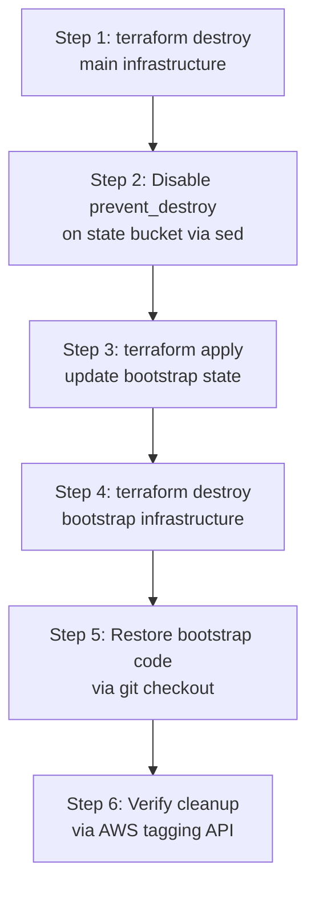

# Phase 7: Validation, Teardown, and Cleanup -- Execution Plan

## Context

Phase 7 is the final phase of the Melio IaC assessment. It assumes Phases 1-6 are complete and produces two script deliverables, runs the infrastructure end-to-end, validates it, tears it down, and commits the results. The authoritative plan is [`melio_iac_assessment_plan_349f73ef.plan.md`](.cursor/plans/melio_iac_assessment_plan_349f73ef.plan.md) -- all infrastructure and state in **af-south-1**, instance type **t3.small**.

---

## Branch Strategy

- Create **`feature/phase-7-validation-teardown`** from current `feature/Iac-implementation` (at commit `d4f9210`)
- All Phase 7 deliverables committed on this branch
- Commit message: `chore: add teardown script, validation script, and validation notes`

---

## Step 7.0: Quality Gate -- Review Phases 1-6 Implementation

Before any terraform operations, audit every module for correctness and alignment with the master plan. This is a structured review, not a full re-read.

### 7.0.1 Bootstrap Audit ([`terraform/bootstrap/`](terraform/bootstrap/))

- **S3 state bucket**: versioned, encrypted (SSE-S3 or KMS), `aws_s3_bucket_public_access_block` set, `prevent_destroy = true`, and critically: **`force_destroy = true`** (required for teardown -- if missing, the teardown script must be adapted to empty buckets via AWS CLI)
- **S3 artifact bucket**: versioned, encrypted, `force_destroy = true`
- **No DynamoDB**: Native S3 locking (`use_lockfile = true`) is used -- no lock table resource
- **Provider**: `profile = var.aws_profile`, `region = var.region` (af-south-1), version `~> 6.0`
- **Local state**: bootstrap must NOT have a backend block (uses local state)
- **Outputs**: `state_bucket_name`, `artifact_bucket_name`, `artifact_bucket_arn`, `state_bucket_arn`, `region` (needed by teardown script and Phase 2 backend config)

**Flag**: If `force_destroy = true` is NOT set on S3 buckets, the teardown script must include AWS CLI bucket-emptying logic as a fallback (see Step 7.4).

### 7.0.2 Root Module Audit ([`terraform/`](terraform/))

- [`providers.tf`](terraform/providers.tf): AWS provider `~> 6.0`, `required_version = ">= 1.9"`, `profile = var.aws_profile`, `region = var.region`, `default_tags` block with Project/Environment/ManagedBy
- [`backend.tf`](terraform/backend.tf): S3 backend pointing to state bucket in af-south-1, `use_lockfile = true`, `encrypt = true`
- [`variables.tf`](terraform/variables.tf): `region` (default af-south-1 with validation), `project_name`, `environment`, `instance_type` (default t3.small), `aws_profile`, `ssh_cidr` (optional)
- [`locals.tf`](terraform/locals.tf): `name_prefix = "${var.project_name}-${var.environment}"`
- [`main.tf`](terraform/main.tf): all 4 modules wired (networking, security, compute, alb) with correct inter-module references
- [`outputs.tf`](terraform/outputs.tf): `alb_dns_name`, instance IPs, SSH key marked `sensitive = true`

### 7.0.3 Module-Level Audit

**Networking** ([`terraform/modules/networking/`](terraform/modules/networking/)):
- VPC `10.0.0.0/16`, 2 public subnets (af-south-1a `10.0.1.0/24`, af-south-1b `10.0.2.0/24`), IGW, route tables with `0.0.0.0/0` -> IGW, `map_public_ip_on_launch = true`

**Security** ([`terraform/modules/security/`](terraform/modules/security/)):
- SG matrix per master plan: alb-sg (inbound 80 from 0.0.0.0/0, outbound 80 to frontend-sg), frontend-sg (inbound 80 from alb-sg, optional SSH), backend-sg (inbound 8082+8083 from frontend-sg, optional SSH)
- IAM role with SSM `GetParameter` (scoped `/app/*`) + S3 `GetObject` on artifact bucket
- Instance profile attached to role
- SSM parameter `/app/newsfeed-service-token` (SecureString, sensitive variable)

**Compute** ([`terraform/modules/compute/`](terraform/modules/compute/)):
- 3x `aws_instance` (t3.small, AL2023 AMI via data source, all in subnet-a)
- `aws_key_pair` with TLS-generated key
- User data templates: `set -euxo pipefail`, `dnf install`, S3 download with retry (`for i in 1 2 3`), systemd units with `-Xmx512m -XX:+UseSerialGC`, SSM token read (frontend only), nginx config (frontend only)
- Templates: [`frontend.sh.tpl`](terraform/modules/compute/templates/frontend.sh.tpl), [`quotes.sh.tpl`](terraform/modules/compute/templates/quotes.sh.tpl), [`newsfeed.sh.tpl`](terraform/modules/compute/templates/newsfeed.sh.tpl), [`nginx.conf.tpl`](terraform/modules/compute/templates/nginx.conf.tpl)

**ALB** ([`terraform/modules/alb/`](terraform/modules/alb/)):
- ALB in both subnets (af-south-1a + af-south-1b), `alb-sg`
- Target group: port 80, HTTP, health check `GET /ping` on **port 80**, interval 30s, healthy threshold 2
- HTTP listener port 80 forwarding to target group
- Frontend instance registered in target group
- Output: ALB DNS name

### 7.0.4 Alignment Checklist

Run these commands to verify code quality:

```bash
cd terraform && terraform fmt -check -recursive
cd terraform && terraform validate
cd terraform/bootstrap && terraform fmt -check && terraform validate
```

If any misalignment with the master plan is found, fix it before proceeding to Step 7.1.

---

## Step 7.1: Write `scripts/validate.sh`

**File**: [`scripts/validate.sh`](scripts/validate.sh)

An automated validation script that:
- Reads `alb_dns_name` from `terraform output`
- Retries health checks with configurable backoff (default: 10 attempts, 15s intervals = ~2.5 min max wait)
- Tests 3 endpoints:
  - `GET /ping` -- expects HTTP 200 (health check, validates nginx + JVM)
  - `GET /` -- expects HTTP 200 with HTML body containing quotes content
  - `GET /css/bootstrap.min.css` -- expects HTTP 200 (validates nginx static serving)
- Reports PASS/FAIL per check with clear output
- On failure: prints debug guidance (SSH to check `/var/log/cloud-init-output.log`)
- Follows shell conventions: `#!/bin/bash`, `set -euo pipefail`
- Accepts optional `--alb-dns` flag to override terraform output lookup

---

## Step 7.2: Write `scripts/teardown.sh`

**File**: [`scripts/teardown.sh`](scripts/teardown.sh)

### Teardown Ordering (critical)



### Design Details

- **Safety prompt**: Requires explicit `yes` confirmation (skippable with `-y` flag for CI)
- **Step 1 -- Destroy main infra**: `cd terraform && terraform init -input=false && terraform destroy -auto-approve`. This uses S3 remote state, so the state bucket must still exist. The remote state is updated to show 0 resources.
- **Step 2 -- Disable prevent_destroy**: `sed -i.bak 's/prevent_destroy = true/prevent_destroy = false/g' main.tf` in `terraform/bootstrap/`. This is necessary because `prevent_destroy` does NOT support variable expressions (confirmed: Terraform limitation, still unresolved as of v1.14.x -- only literal booleans are accepted).
- **Step 3 -- Apply bootstrap change**: `terraform apply -auto-approve -input=false`. Updates the state to reflect `prevent_destroy = false`.
- **Step 4 -- Destroy bootstrap**: `terraform destroy -auto-approve`. With `force_destroy = true` on S3 buckets, this handles versioned objects automatically. If `force_destroy` is NOT set, the script must first empty buckets via AWS CLI:

```
aws s3 rm "s3://$BUCKET" --recursive --profile "$AWS_PROFILE" --region "$AWS_REGION"
aws s3api list-object-versions --bucket "$BUCKET" --profile "$AWS_PROFILE" --region "$AWS_REGION" \
  --query '{Objects: Versions[].{Key:Key,VersionId:VersionId}}' --output json | \
  aws s3api delete-objects --bucket "$BUCKET" --delete file:///dev/stdin --profile "$AWS_PROFILE" --region "$AWS_REGION"
```

- **Step 5 -- Restore code**: `git checkout -- terraform/bootstrap/main.tf` (cleaner than restoring .bak file, and keeps working tree clean for commit)
- **Step 6 -- Verify cleanup**: Query `aws resourcegroupstaggingapi get-resources --tag-filters Key=ManagedBy,Values=terraform --region af-south-1` and report any remaining resources

### Edge Cases Handled

- Bootstrap local state file missing: Script checks for `terraform.tfstate` in `terraform/bootstrap/` and warns if absent
- Main terraform already destroyed: Script continues gracefully (terraform destroy on empty state is a no-op)
- Partial teardown: Each step is idempotent; re-running the script is safe
- Windows compatibility: Uses `sed -i.bak` (portable) and `git checkout` for restore

---

## Step 7.3: Pre-apply Validation (Operational)

```bash
cd terraform
terraform init
terraform fmt -check -recursive
terraform validate
terraform plan -out=tfplan
```

- Review plan output: expect **~15-20 resources** (VPC, 2 subnets, IGW, route table, routes, 4 SGs + rules, IAM role/policy/profile, SSM parameter, 3 EC2 instances, key pair, ALB, target group, listener, target group attachment)
- Verify no unexpected changes or deletions
- Check that all outputs are defined (alb_dns_name, instance IPs)

---

## Step 7.4: Apply Infrastructure (Operational)

```bash
terraform apply tfplan
```

- Capture key outputs immediately after apply:

```bash
terraform output alb_dns_name
terraform output frontend_public_ip
```

- Note the ALB DNS for validation

---

## Step 7.5: End-to-End Validation (Operational)

- Wait ~2-3 minutes for EC2 cloud-init to complete (JVM startup, nginx start)
- Run validation script:

```bash
./scripts/validate.sh
```

- **Expected results**:
  - `/ping` returns HTTP 200 (frontend JVM running, nginx proxying)
  - `/` returns HTML with quotes sidebar (frontend + quotes service communicating)
  - `/css/bootstrap.min.css` returns HTTP 200 (nginx serving static assets)
  - Newsfeed section may show partial/empty results (known af-south-1 RSS latency issue -- document, do not fix)

- **If validation fails**: Check cloud-init logs on the failing instance:

```bash
ssh -i <key> ec2-user@<instance-ip> "sudo cat /var/log/cloud-init-output.log"
```

  Common failure modes:
  - S3 artifact download failed (check IAM policy, bucket name, retry logic)
  - JVM OOM (check systemd journal: `journalctl -u <service>`)
  - Nginx config error (check `nginx -t` output in cloud-init log)
  - Security group blocking traffic (verify SG matrix)

---

## Step 7.6: Execute Teardown (Operational)

```bash
./scripts/teardown.sh
```

- Verify all resources destroyed
- Check AWS Console (or CLI) for any lingering resources tagged `ManagedBy=terraform`
- Verify S3 buckets no longer exist
- Verify no `.tflock` files remain in state bucket (should be auto-cleaned)

---

## Step 7.7: Commit

- Stage deliverables: `scripts/validate.sh`, `scripts/teardown.sh`
- Any doc updates (validation notes in README or `docs/trade-offs.md` if needed)
- Commit: `chore: add teardown script, validation script, and validation notes`

---

## Critical Dependencies on Prior Phases

These Phase 1-6 design decisions directly impact Phase 7. If any are not met, the teardown script requires adaptation:

- **Phase 1**: Bootstrap S3 buckets MUST have `force_destroy = true`. Without it, `terraform destroy` fails with "BucketNotEmpty" on versioned buckets. The teardown script includes a fallback (AWS CLI emptying) but `force_destroy` is strongly preferred.
- **Phase 1**: Bootstrap MUST export outputs (`state_bucket_name`, `artifact_bucket_name`, `state_bucket_arn`, `artifact_bucket_arn`) for the teardown script's cleanup verification.
- **Phase 1**: State bucket MUST have `prevent_destroy = true` (the teardown script is designed to flip this via sed).
- **Phase 1**: Bootstrap uses **local state** (no backend block) -- its `terraform.tfstate` lives on disk in `terraform/bootstrap/`. This file must exist for teardown.
- **Phase 4**: User data scripts MUST use `set -euxo pipefail` -- without this, cloud-init failures are silent and validation debugging becomes very difficult.
- **Phase 5**: Root `outputs.tf` MUST export `alb_dns_name` -- the validate script reads this via `terraform output`.

---

## Potential Issues and Mitigations

- **ALB target health check delay**: ALB may take 30-60s after EC2 boot to mark targets healthy. Validate script retries with backoff (10 x 15s = 2.5min max).
- **Cloud-init slow boot**: AL2023 + dnf install + S3 download + JVM start can take 2-3 minutes. Validate script accommodates this via retry logic.
- **RSS feed timeout from af-south-1**: Newsfeed service fetches US-hosted RSS with 1s timeout. Cape Town RTT is ~250-350ms. Expect partial/empty newsfeed. This is documented as a known limitation, not a validation failure.
- **Bootstrap local state loss**: If `terraform/bootstrap/terraform.tfstate` is deleted, bootstrap resources become orphaned. Teardown script checks for this file and warns. Manual AWS Console cleanup would be needed.
- **Windows `sed` compatibility**: Using `sed -i.bak` which works on Git Bash for Windows. Restore via `git checkout` which is fully cross-platform.
- **`prevent_destroy` cannot use variables**: Confirmed limitation in Terraform through v1.14.x (issue #22544, #5346 still open). The `sed` approach is the standard workaround recommended by Spacelift and HashiCorp community.

---

## Tools and MCPs Used

- **Perplexity MCP** (`perplexity_search`): Researched `prevent_destroy` + `force_destroy` interaction, versioned S3 bucket deletion patterns, terraform destroy ordering with S3 remote state, `prevent_destroy` variable expression support (confirmed still unsupported)
- **Codebase exploration subagents**: Full repo tree, all plan files, git state, terraform rules, tfvars.example
- **Built-in tools**: Read, Glob, Shell (git branch/log)
