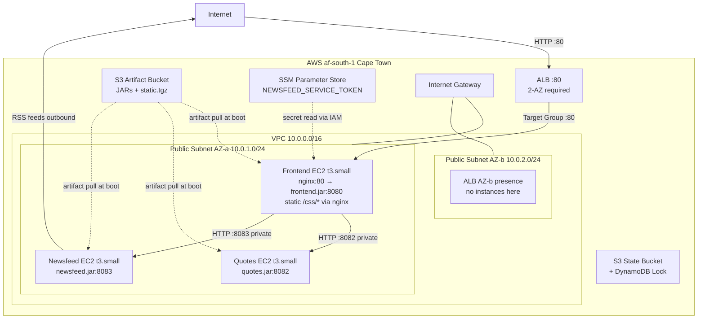

# DevOps Assessment

This project contains three services:

* `quotes` which serves a random quote from `quotes/resources/quotes.json`
* `newsfeed` which aggregates several RSS feeds together
* `front-end` which calls the two previous services and displays the results.

## Prerequisites

* Java
* [Leiningen](http://leiningen.org/) (can be installed using `brew install leiningen`)

## Running tests

You can run the tests of all apps by using `make test`

## Building

First you need to ensure that the common libraries are installed: run `make libs` to install them to your local `~/.m2` repository. This will allow you to build the JARs.

To build all the JARs and generate the static tarball, run the `make clean all` command from this directory. The JARs and tarball will appear in the `build/` directory.

### Static assets

`cd` to `front-end/public` and run `./serve.py` (you need Python3 installed). This will serve the assets on port 8000.

## Running

All the apps take environment variables to configure them and expose the URL `/ping` which will just return a 200 response that you can use with e.g. a load balancer to check if the app is running.

### Front-end app

`java -jar front-end.jar`

*Environment variables*:

* `APP_PORT`: The port on which to run the app
* `STATIC_URL`: The URL on which to find the static assets
* `QUOTE_SERVICE_URL`: The URL on which to find the quote service
* `NEWSFEED_SERVICE_URL`: The URL on which to find the newsfeed service
* `NEWSFEED_SERVICE_TOKEN`: The authentication token that allows the app to talk to the newsfeed service. This should be treated as an application secret. The value should be: `T1&eWbYXNWG1w1^YGKDPxAWJ@^et^&kX`

### Quote service

`java -jar quotes.jar`

*Environment variables*

* `APP_PORT`: The port on which to run the app

### Newsfeed service

`java -jar newsfeed.jar`

*Environment variables*

* `APP_PORT`: The port on which to run the app

---

## Infrastructure Deployment

This section documents the AWS infrastructure-as-code (Terraform) deployment of the 3-service Clojure MVP to AWS af-south-1 (Cape Town). The infrastructure provisions a VPC, 3 EC2 instances, an Application Load Balancer, and supporting resources via modular Terraform.

### Story Refinement

The assessment asks candidates to push back on underspecified stories. This section documents the pragmatic scoping decisions made.

> **Original story**: "I need some infrastructure code to provision an environment in the cloud to test features, and deploy the microservices, so that I can verify that the microservices are working"

**Refined scope** ( assume as agreed with stakeholders):
- Single region (af-south-1), single environment (dev), no HA
- HTTP only (no TLS) -- sufficient for dev/test verification
- Public subnets only (no NAT gateway) -- acceptable for non-production
- No CI/CD pipeline -- manual build-and-deploy for now
- No monitoring/alerting -- basic health checks only via ALB
- Cleanup/teardown included since this is temporary infrastructure

**Out of scope** (documented in [docs/future-work.md](docs/future-work.md)):
- Multi-AZ redundancy, auto-scaling groups
- Private subnets + NAT gateway for backends
- TLS termination with ACM certificates
- CI/CD pipeline, monitoring, multi-environment, container migration

### Prerequisites

- **Terraform** >= 1.10 (tested with v1.14.8)
- **AWS CLI** v2
- **Docker Desktop** (primary build method) OR Java 17 + Leiningen 2.12
- AWS profile `charteracademy` with af-south-1 region enabled
- Copy `terraform/terraform.tfvars.example` to `terraform/terraform.tfvars` and fill in `artifact_bucket_arn` from bootstrap output

### Quick Start

```bash
# 1. Bootstrap state + artifact bucket (one-time)
cd terraform/bootstrap && terraform init && terraform apply

# 2. Build JARs via Docker
cd ../.. && ./scripts/build-docker.sh

# 3. Upload artifacts to S3
./scripts/deploy.sh

# 4. Deploy infrastructure
cd terraform && terraform init && terraform apply \
  -var="newsfeed_service_token=YOUR_TOKEN"

# 5. Wait 2-3 minutes, then open the ALB DNS URL
terraform output application_url
```

### Terraform Variables

| Variable | Default | Description |
|---|---|---|
| `region` | `af-south-1` | AWS region (af-south-1 or us-east-1) |
| `project_name` | `melio-devops` | Resource naming prefix |
| `environment` | `dev` | Deployment environment |
| `instance_type` | `t3.small` | EC2 instance type (t2/t3 family) |
| `aws_profile` | `charteracademy` | AWS CLI profile |
| `ssh_cidr` | `""` (disabled) | CIDR for SSH access (e.g. `YOUR_IP/32`) |
| `artifact_bucket_arn` | *(required)* | S3 artifact bucket ARN from bootstrap |
| `newsfeed_service_token` | *(required, sensitive)* | Auth token (pass via `-var`, never in tfvars) |

See [terraform/terraform.tfvars.example](terraform/terraform.tfvars.example) for a template.

### Architecture



See [docs/architecture.md](docs/architecture.md) for detailed architecture description, security model, and data flow.

### Secrets Handling

- `NEWSFEED_SERVICE_TOKEN` is stored in AWS SSM Parameter Store as a SecureString
- Read at EC2 boot via IAM role attached to instance profile (`ssm:GetParameter`)
- Never stored in `.tf` files or `terraform.tfvars`
- Pass via CLI: `terraform apply -var="newsfeed_service_token=VALUE"`
- **Note**: The token value exists in the application source code (`newsfeed/core.clj`). SSM demonstrates the production-correct pattern for secrets management.

### Verification

```bash
# Health check
curl -s http://$(terraform output -raw alb_dns_name)/ping

# Open in browser -- verify quotes sidebar + newsfeed list
open http://$(terraform output -raw alb_dns_name)
```

### Known Limitations

- **RSS feed latency from af-south-1**: Newsfeed fetches RSS from US-hosted sites (Reddit, HN) with ~250-350ms RTT. The service's 1s timeout may cause partial/empty results. Quotes page is unaffected.
- **Boot timing**: Frontend may start before backends are ready. Refresh after 30-60 seconds.
- **No HA**: Single instance per service, single AZ for compute. ALB spans 2 AZs (AWS requirement).
- **HTTP only**: No TLS. Sufficient for dev/test verification.

### Teardown

```bash
# Destroy all infrastructure (main + bootstrap)
./scripts/teardown.sh
```

The teardown script runs `terraform destroy` for the main infrastructure, then the bootstrap resources. The state bucket's `prevent_destroy` lifecycle rule is overridden during teardown.

### Cost Estimate (af-south-1, 2-3 hour demo)

| Resource | Rate | Cost |
|---|---|---|
| 3 × t3.small | ~$0.0264/hr each | ~$0.16 |
| ALB | ~$0.027/hr | ~$0.07 |
| S3 (state + artifacts) | negligible | ~$0.00 |
| SSM | free tier | $0.00 |
| DynamoDB (lock table) | PAY_PER_REQUEST | ~$0.00 |
| **Total** | | **~$0.23** |

### Planning Methodology

This project was built using Cursor IDE's built-in planning system. Each phase was planned, executed, and validated through structured plan files stored in `.cursor/plans/`. This approach provides:

- **Traceability**: Every infrastructure decision maps to a plan
- **Phased delivery**: Complex work broken into independently reviewable phases
- **Validation gates**: Each phase has an execution plan and a validation report

#### Plan Files Reference

| File | Purpose |
|---|---|
| `melio_iac_assessment_plan_349f73ef.plan.md` | **Master plan** -- full architecture, phased approach, design decisions, risk matrix |
| `melio_iac_assessment_revised_f90c4ee2.plan.md` | **Revised plan** -- deep analysis identifying gaps in the original, region-change implications |
| `phase_0_execution_85ed0d57.plan.md` | Phase 0: Project scaffolding execution steps |
| `phase_0_validation_report_47e8a375.plan.md` | Phase 0: Validation that scaffolding is correct |
| `phase_1_bootstrap_build_71bed900.plan.md` | Phase 1: Bootstrap (S3 + DynamoDB) and build scripts |
| `phase_1_validation_report_9bedd09a.plan.md` | Phase 1: Validation of bootstrap and artifact upload |
| `phase_2_networking_execution_790a569f.plan.md` | Phase 2: VPC, subnets, IGW implementation |
| `phase_2_validation_report_e155ba96.plan.md` | Phase 2: Networking module validation and DynamoDB corrections |
| `phase_3_security_evaluation_bc2d37b3.plan.md` | Phase 3: Security module evaluation (gap analysis) |
| `phase_3_security_execution_0bbe2a68.plan.md` | Phase 3: Security groups, IAM, SSM implementation |
| `phase_4_compute_evaluation_1b9bc6fd.plan.md` | Phase 4: Compute module evaluation (gap analysis) |
| `phase_4_compute_execution_c4eecf8b.plan.md` | Phase 4: EC2 instances, user data, systemd implementation |
| `phase_5_alb_execution_9cdfdfe8.plan.md` | Phase 5: ALB, target groups, health checks implementation |
| `phase_6_docs_execution_409927ba.plan.md` | Phase 6: Documentation and future work (this phase) |
| `phase_7_execution_plan_e0e5e95f.plan.md` | Phase 7: Validation, apply, teardown plan |

Each plan uses YAML front matter with todo tracking (`pending` → `in_progress` → `completed`) and documents tools/MCPs used (Perplexity, Context7, codebase exploration).

### Further Reading

- [docs/architecture.md](docs/architecture.md) -- Detailed architecture, security model, data flow
- [docs/trade-offs.md](docs/trade-offs.md) -- 19 design decisions with structured rationale
- [docs/future-work.md](docs/future-work.md) -- Production improvements roadmap
- [.cursor/plans/](/.cursor/plans/) -- All phase plans with execution and validation details
