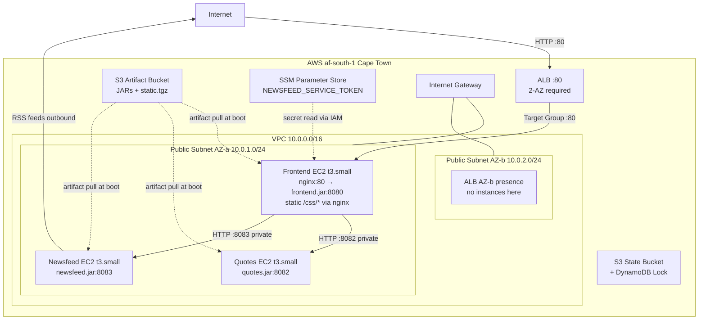

# Architecture

## Overview

Three Clojure microservices (frontend, quotes, newsfeed) deployed to AWS af-south-1 (Cape Town) on separate EC2 instances (t3.small, Amazon Linux 2023). Traffic enters via an Application Load Balancer on port 80, hits the frontend's nginx reverse proxy, which serves static CSS and proxies API requests to the frontend JVM. The frontend calls the quotes and newsfeed backends over private IPs within a single VPC subnet. Build artifacts (JARs + static assets) are stored in S3 and pulled at boot via EC2 user data. The newsfeed service token is stored in SSM Parameter Store and read at boot via IAM.

## Architecture Diagram



## Services

### Frontend

- **EC2**: t3.small in public subnet AZ-a (af-south-1a)
- **nginx**: Listens on port 80 as `default_server`. Serves static CSS at `/css/*` via alias to `/opt/app/static/css/`. All other requests proxied to `127.0.0.1:8080` (frontend JVM).
- **JVM**: `front-end.jar` on port 8080 with `-Xmx512m -XX:+UseSerialGC`
- **Environment**: `APP_PORT=8080`, `STATIC_URL=""` (nginx serves static), `QUOTE_SERVICE_URL=http://<quotes-private-ip>:8082`, `NEWSFEED_SERVICE_URL=http://<newsfeed-private-ip>:8083`, `NEWSFEED_SERVICE_TOKEN` (from SSM)
- **Health check**: `GET /ping` returns HTTP 200 (independent of backend availability)

### Quotes

- **EC2**: t3.small in public subnet AZ-a (af-south-1a)
- **JVM**: `quotes.jar` on port 8082 with `-Xmx512m -XX:+UseSerialGC`
- **Environment**: `APP_PORT=8082`
- **Behavior**: Returns random quotes from embedded `quotes.json`. No external dependencies. Low latency, always available.

### Newsfeed

- **EC2**: t3.small in public subnet AZ-a (af-south-1a)
- **JVM**: `newsfeed.jar` on port 8083 with `-Xmx512m -XX:+UseSerialGC`
- **Environment**: `APP_PORT=8083`
- **Behavior**: Aggregates RSS feeds from external sources (Reddit, Hacker News, Martin Fowler, ThoughtWorks). Requires auth token from the frontend. Subject to ~250-350ms RTT from af-south-1 to US-hosted RSS sources; the hardcoded 1s timeout may cause partial/empty results.

## Networking

- **VPC**: `10.0.0.0/16` with DNS support and DNS hostnames enabled
- **Public Subnet AZ-a**: `10.0.1.0/24` in af-south-1a -- all 3 EC2 instances placed here
- **Public Subnet AZ-b**: `10.0.2.0/24` in af-south-1b -- ALB presence only (AWS requires 2 AZs for ALB)
- **Internet Gateway**: Attached to VPC, routes `0.0.0.0/0` traffic via public route table
- **Route Table**: Single public route table associated with both subnets; default route to IGW
- **No NAT Gateway**: All instances have public IPs via `map_public_ip_on_launch = true`. Acceptable for dev; private subnets documented as future work.

## Security Model

### Security Group Matrix

| SG | Inbound | Source | Outbound | Notes |
|---|---|---|---|---|
| `alb-sg` | TCP 80 | 0.0.0.0/0 | TCP 80 to `frontend-sg` | Tightened: ALB only reaches frontend |
| `frontend-sg` | TCP 80 | `alb-sg` | All 0.0.0.0/0 | Reaches backends + any outbound |
| `frontend-sg` | TCP 22 | `var.ssh_cidr` (optional) | -- | Debug-only; disabled by default |
| `backend-sg` | TCP 8082 | `frontend-sg` | All 0.0.0.0/0 | Quotes from frontend only |
| `backend-sg` | TCP 8083 | `frontend-sg` | All 0.0.0.0/0 | Newsfeed from frontend only |
| `backend-sg` | TCP 22 | `var.ssh_cidr` (optional) | -- | Debug-only; disabled by default |

Security group rules use standalone `aws_vpc_security_group_ingress_rule` / `aws_vpc_security_group_egress_rule` resources per AWS provider ~> 6.0 best practices (not inline blocks).

### IAM

- **Role**: `app-instance-role` with EC2 assume-role trust policy
- **Inline policy**: `s3:GetObject` on artifact bucket + `s3:ListBucket` + `ssm:GetParameter` scoped to `/app/*`
- **Instance profile**: Shared by all 3 instances
- **SSM Parameter**: `/app/newsfeed-service-token` (SecureString, default AWS managed KMS key)

### SSH Access

Disabled by default (`ssh_cidr = ""`). Set `ssh_cidr` to `YOUR_IP/32` for debugging. Production should use SSM Session Manager instead.

## Data Flow

### Request Path

```
Internet → ALB:80 → frontend-sg → nginx:80 → frontend.jar:8080
                                                  ├── http://<quotes-ip>:8082  (backend-sg)
                                                  └── http://<newsfeed-ip>:8083 (backend-sg)
                                                        └── RSS feeds (outbound to internet)
```

### Artifact Delivery

```
S3 artifact bucket ← deploy.sh uploads JARs + static.tgz
                   → EC2 user data pulls at boot (with 3-attempt retry)
```

## EC2 Boot Sequence

Each instance follows this user data flow (all scripts begin with `set -euxo pipefail`):

1. **Install packages**: `dnf install -y java-17-amazon-corretto-headless` (+ `nginx` for frontend)
2. **Create directories**: `/opt/app/` (+ `/opt/app/static/` for frontend)
3. **Download artifacts from S3**: JAR file with 3-attempt retry loop; frontend also downloads `static.tgz`
4. **Extract static assets** (frontend only): `tar -xzf static.tgz -C /opt/app/static/`
5. **Read SSM secret** (frontend only): `aws ssm get-parameter --with-decryption` for `NEWSFEED_SERVICE_TOKEN`
6. **Write environment file**: `/opt/app/<service>.env` with `APP_PORT` and service-specific vars
7. **Create systemd unit**: `/etc/systemd/system/<service>.service` with `EnvironmentFile`, JVM flags (`-Xmx512m -XX:+UseSerialGC`), `Restart=on-failure`
8. **Configure nginx** (frontend only): Drop custom config into `/etc/nginx/conf.d/frontend.conf`, remove default site
9. **Start services**: `systemctl enable --now <service>` (+ `nginx` for frontend)
10. **Log completion**: `systemd-cat -t user-data`

## Terraform Module Structure

```
terraform/
├── providers.tf              # AWS ~> 6.0, profile, region, default_tags
├── backend.tf                # S3 remote state + DynamoDB lock
├── main.tf                   # Module wiring
├── variables.tf              # Root inputs with validation
├── locals.tf                 # name_prefix, artifact_bucket_name
├── outputs.tf                # ALB DNS, instance IPs, SSH key
├── terraform.tfvars.example  # Template (terraform.tfvars is gitignored)
├── modules/
│   ├── networking/           # VPC, 2 subnets, IGW, route tables
│   ├── security/             # 3 SGs, IAM role/profile, SSM parameter
│   ├── compute/              # 3 EC2s, key pair, user data templates
│   │   └── templates/        # frontend.sh.tpl, quotes.sh.tpl, newsfeed.sh.tpl, nginx.conf.tpl
│   └── alb/                  # ALB, target group, listener, health checks
└── bootstrap/                # One-time: S3 state bucket + artifact bucket + DynamoDB lock
```
