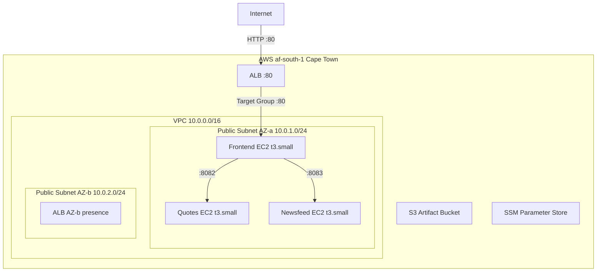

# Architecture

## Overview

<!-- Brief description of the 3-service Clojure MVP deployed to AWS af-south-1 -->

## Architecture Diagram

<!-- Embed or reference the mermaid diagram from the assessment plan -->

## Services

### Frontend
<!-- nginx reverse proxy on port 80, proxies to frontend.jar:8080, serves static CSS -->

### Quotes
<!-- Serves random quotes from quotes.json on port 8082 -->

### Newsfeed
<!-- Aggregates RSS feeds, serves on port 8083, requires auth token -->

## Networking

<!-- VPC, subnets, IGW, route tables, security groups -->

## Security Model

<!-- Security groups, IAM roles, SSM for secrets, no SSH by default -->

## Data Flow

<!-- Internet -> ALB -> nginx -> frontend.jar -> quotes/newsfeed backends -->
<!-- EC2 user data pulls JARs from S3 at boot -->
<!-- Frontend reads NEWSFEED_SERVICE_TOKEN from SSM at boot -->
